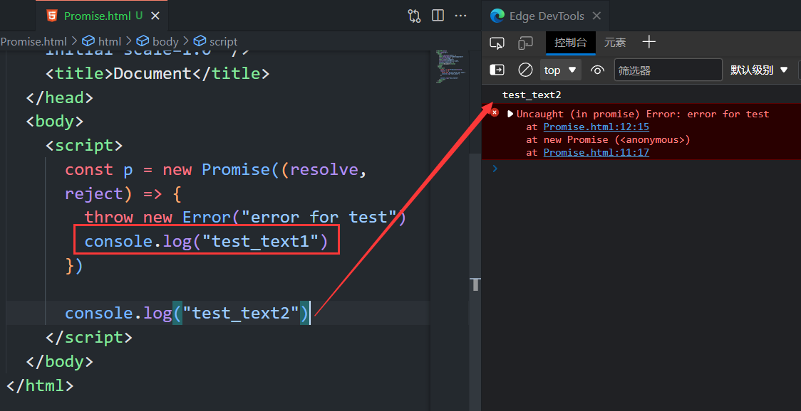
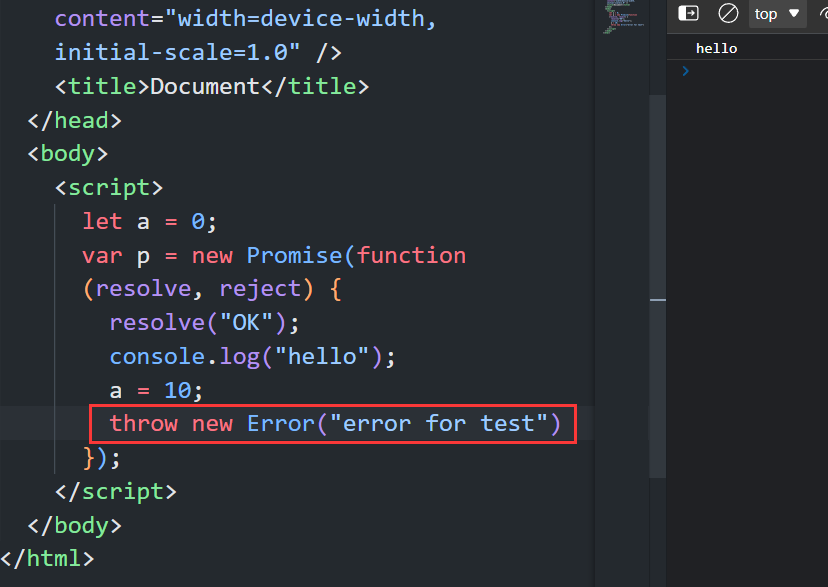
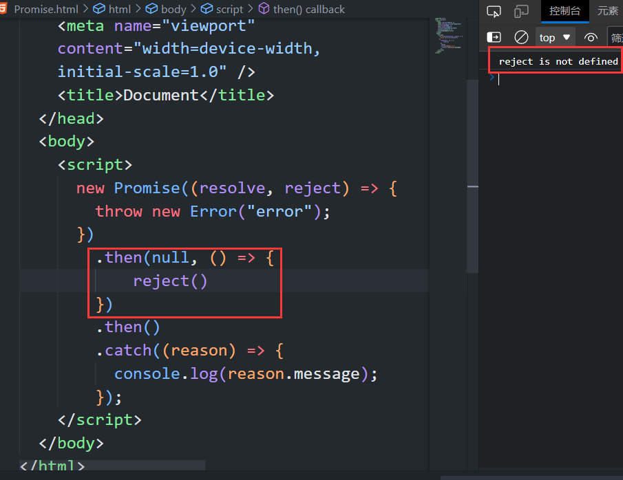

#### Promise中错误与Promise外错误的区别

在Promise中发生的错误在控制台报错时会在错误类型前附加`(in promise)`表示这是promise中的错误而非全局错误,eg:`Uncaught (in promise) ReferenceError: num is not defined`.

>被动发生的语法错误是全局性的, 任何情况下被动发生语法错误程序都会停止运行并在控制台进行警告, 即使在Promise中也没有`(in promise)`.


Promise内部的错误不会反应到外部。

```js
try {
var p2 = new Promise(function (resolve, reject) {
   throw new Error("Pending Error");
});
} catch (e) {
console.log("catch error");
}
```

上述代码不会输出"catch error"，所以，异常没有被捕获，而是会触发"Uncaught (in promise) Error: Pending Error"，即Promise内部抛出的错误不会反应到外部，此时p2的状态是Rejected。


所以Promise内的错误无论是否被捕获,都不会影响Promise外部程序的执行.




>注意:有一种情况下Promise中的错误会成为全局错误:
>
>Promise的函数参数中指定下一轮事件循环发生错误:
>
>```js
>const promise = new Promise(function (resolve, reject) {
>resolve('ok');
>setTimeout(function () { throw new Error('test') }, 0)
>});
>promise.then(function (value) { console.log(value) });
>// ok
>// Uncaught Error: test
>```
>
>上面代码中，Promise 指定在下一轮“事件循环”再抛出错误。到了那个时候，Promise 的运行已经结束了，所以这个错误是在 Promise 函数体外抛出的，所以会成为全局错误.


#### Promise中Error的特征

- Promise中**未被捕获的**错误会将Promise的状态转变为Rejected, 并且跳过执行Promise回调函数中剩余代码, 将错误(对象)传递给Rejected回调函数并且执行此函数.

  >在错误处理机制方面, Promise的回调函数类似于try{}包含块,Rejected回调函数相当于try{}包含块.

- Promise中**未被捕获的**错误和`reject()`的区别在于是否会跳过Promise回调函数中剩余代码的执行.

- Promise的状态一旦发生改变,则之后的错误将不会发生,因为发生错误会改变promise的状态,而promise的状态只能改变一次.

  

  一般来说，调用`resolve`或`reject`以后，Promise 的使命就完成了，后继操作应该放到`then`方法里面，而不应该直接写在`resolve`或`reject`的后面。所以，最好在它们前面加上`return`语句，这样就不会有意外。

  ```js
  new Promise((resolve, reject) => {
    return resolve(1);
    // 后面的语句不会执行
    console.log(2);
  })
  ```


#### 异常穿透

Promise对象的错误具有“冒泡”性质，当Promise链中任一Resolved回调发生错误时,此错误会顺着后续链中的Rejected向后传递.

>当Promise链中任一Resolved回调发生错误时,链中后续的Resolved回调都不会执行,执行的是后续链中的Rejected回调.

```js
var p = new Promise(function (resolve, reject) {
      throw new Error("error");
});

p.then(function () { console.log('pass');})       // 没有输出
 .then(function () { console.log('pass');})       // 没有输出
 .then(function () { console.log('pass');})       // 没有输出
 .catch(function (value) { console.log(value);}); // 输出error
```

**原理**

在then()中并没有传入处理失败数据的回调, 错误为什么还会正常往下传递呢?

then()中的两个函数参数都是有默认值的:

```js
new Promise((resolve, reject) => {
    resolve(1)
}).then(
//第一个函数参数的默认值为:
(data) => Promise.resolve(data),
//第二个函数参数的默认值为:
(err) => Promise.reject(err),
// 或
(err) => { throw err; }
).catch
```

可是一旦手动添加了then方法的Onjected回调函数,则此then方法会按照规则返回Promise对象.

> 在链中手动添加了Onjected回调函数,则链中此Onjected回调函数之前的错误会在此被拦截,不会继续向下传递.如果这个Onjected回调中发生了新的错误,会将此错误向下传递.

所以:**要想异常穿透到最后的catch中,则链上的每一个then方法最好都别添加Onjected回调函数,要添加则必须确保返回正确的Promise**



图中因为在链中的第一个then方法中设置了Onjected回调函数,且没有返回正确的Promise(没有将error进行传递),所以导致后续的Onjected无法接收到最开始的异常.