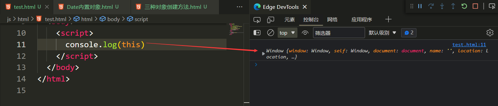
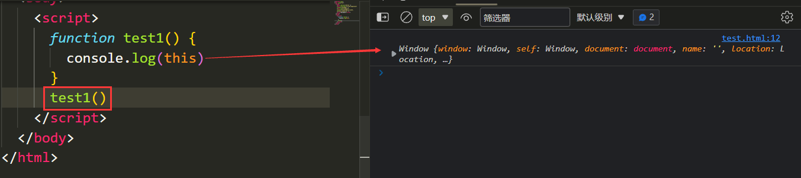
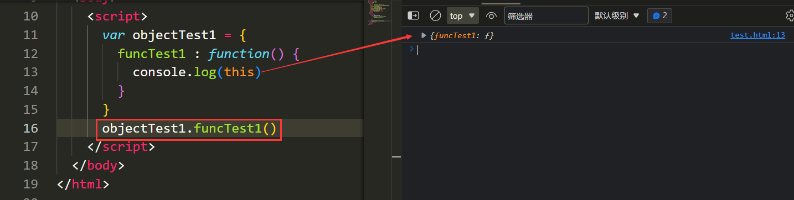
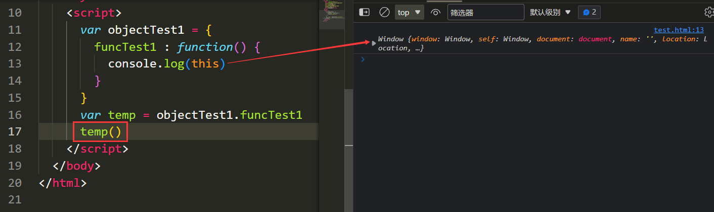
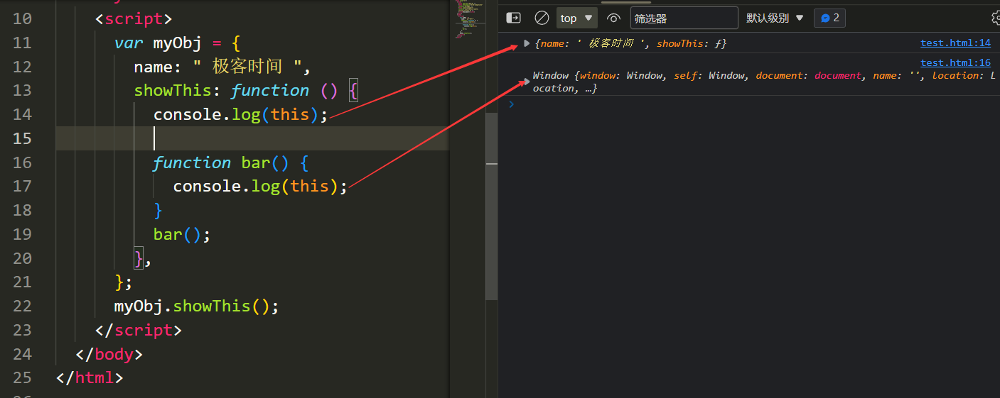

# this指向解析
### JS中this的概念

`this`是一个只能指向对象(这里的对象指的是普通对象,而非函数对象或数组对象)的指针,并且和执行上下文绑定,即每一个执行上下文都有一个指向某对象的`this`指针.


执行上下文有三种:全局执行上下文、函数执行上下文和eval函数执行上下文,它们都有对应的`this`指针,并且都有默认的指向(以下简称"指向"):

### 1.全局执行上下文的`this`指针

全局执行上下文的`this`指向全局对象window

在全局环境下输入`console.log(this)`并输出即可查看全局执行上下文的`this`指向:




### 2.函数执行上下文的`this`指针

函数执行上下文的`this`指针指向直接调用此函数的对象:

- 直接在全局环境中调用函数

   在全局环境中直接调用函数相当于`window.test1()`,所以直接调用函数的对象为window,则此时test1函数执行上下文的`this`指向全局对象window

- 通过对象调用其方法

  

  通过对象调用其方法相当于`window.objectTest1.funcTest1()`,直接调用函数的对象为objectTest1,所以此时函数funcTest1函数执行上下文的`this`指向objectTest1对象

- 将对象的方法赋值给全局变量,并通过此变量来调用对象的方法

  

  此时`temp`和`objectTest1.funcTest1`指向的是同一个函数,通过`temp`调用这个函数相当于`window.temp()`,直接调用次函数的对象是window,所以此时函数`objectTest1.funcTest1`也即`temp`执行上下文的`this`指向window对象


### 注意:**嵌套函数中的 this 不会从外层函数中继承**

​	

如图:在showThis 方法里面添加了一个 bar 函数，然后接着在 showThis 方法中调用了 bar 函数,如图所示,showThis函数执行上下文的this指向直接调用它的myObj对象,而bar函数执行上下文的this则指向了window对象.

>猜测:不管在什么环境下,只要是直接调用而非通过自定义对象调用的函数执行上下文的`this`都指向window,通过自定义对象调用的函数执行上下文的`this`则指向直接调用次函数的对象

#### 使嵌套函数的this变为可继承的方法

##### 1.用一个变量保存外层函数的this

比如在 showThis 函数中声明一个变量 self 用来保存 this，然后在 bar 函数中使用 self代替bar函数的this，代码如下所示：

```js
var myObj = {
        name: " 极客时间 ",
        showThis: function () {
          console.log(this);
          var self = this;
          function bar() {
            self.name = " 极客邦 ";
              console.log(self);
          }
          bar();
        },
      };
      myObj.showThis();
      console.log(myObj.name);
      console.log(window.name);


//输出结果:
{name: ' 极客时间 ', showThis: ƒ}
{name: ' 极客邦 ', showThis: ƒ}
极客邦
```

最终 myObj 中的 name 属性值变成了“极客邦”。其实，这个方法的的本质是利用变量的作用域机制将外层函数的this值传递给内层函数

##### 2.使用 ES6 中的箭头函数

箭头函数并不会创建其自身的执行上下文，所以所以它会继承调用函数中的 this

```js
var myObj = {
        name: " 极客时间 ",
        showThis: function () {
          console.log(this);
          var bar = () => {
            this.name = " 极客邦 ";
            console.log(this);
          };
          bar();
        },
      };
      myObj.showThis();
      console.log(myObj.name);
      console.log(window.name);

//输出结果:
{name: ' 极客时间 ', showThis: ƒ}
{name: ' 极客邦 ', showThis: ƒ}
极客邦
```

