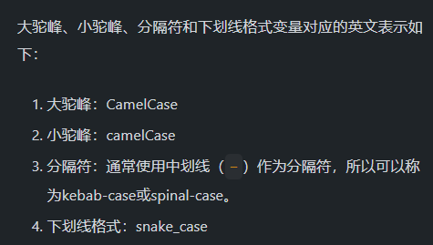

使用`unplugin-vue-components/vite` `unplugin-auto-import/vite` `unplugin-icons`

图标的使用有两种情况:

1. 直接使用图标组件(静态图标)

   使用`unplugin-vue-components/vite` 配合`unplugin-icons`即可

2. 将图标组件/名传入属性中(动态图标)

   属性值为图标组件的注册名或者组件的定义

   这种情况下最好使用iconify提供的`Iocn`组件,并利用``unplugin-vue-components/vite`的自定义解析器来实现`Icon`组件的按需自动导入.

   首先安装:

   ```bash
   pnpm install -D @iconify/vue
   ```

   使用:

   ```vue
   <Icon icon="ep:full-screen" />
   ```

   自定义解析器配置:

   ```js
   Components({
             //自定义解析器: 用于自动引入Icon组件
             (componentName) => {
               if (componentName === 'Icon')
                 return { name: componentName, from: '@iconify/vue' }
             },
           ],
         }),
   ```

   也可以使用`<component>`组件,

   ```vue
   <script setup>
   import {Plus} from '@element-plus/icons-vue'
   </script>

   <template>
     <!-- 图标组件的定义 -->
     <component :is="Plus" />
     <!-- 图标组件的注册名(已注册为全局组件) -->
     <component is="Minus" />
   </template>
   ```

   但`<component>`组件有限制: 如果想用字符串(图标组件注册名)作为is属性的值,则此图标组件必须在本组件内注册或者注册为全局组件.

   然而在有些情况下图标组件是根据数据动态变化的,不可能逐一注册要用到的图标组件, 例如动态菜单的菜单项前面的图标, 是需要根据路由元信息来确定的:

   ```js
   <Icon :icon="item.meta.icon" />
   ```

   此时使用Icon组件就不存在这种限制.

   路由元信息中的图标名称可能为CamelCase格式,需要转换为kebab-case格式,因为icon属性的最终值(iconify图标名称)格式为:`<组织名>:kebab-case`

   CamelCase=>kebab-case转换函数:

   ```js
   function CamelToKebab(str) {
   return str
   		.replace(/\B([A-Z])/g, '-')
   		.toLowerCase()
   		.replace(/^./, str=> str.toLowerCase());
   }
   ```

   >camelCase=>kebab-case转换函数:
   >
   >```js
   >function camelToKebab(str){
   >return str.replace(/\B([A-Z])/g, '-$1').toLowerCase()
   >}
   >```
   >
   >kebab-case=>CamelCase转换函数:
   >
   >```js
   >function kebabToCamel(str) {
   >return str
   >		.replace(/-([a-z])/g, str => str[1].toUpperCase())
   >	.replace(/^./, str => str.toUpperCase());
   >}
   >```
   >
   >kebab-case=>camelCase转换函数:
   >
   >```js
   >function kebabToCamel(str) {
   >return str.replace(/-([a-z])/g, str => str[1].toUpperCase());
   >}
   >```
   >
   >


   还有一种情况,不能使用`Icon`组件和`component`组件, 组件库中的组件的属性需要传入组件的定义或者组件的注册名,例如

   ```vue
   <el-button type="primary" :icon="Edit" />
   ```

   这种情况可以使用使用`unplugin-auto-import/vite`自动按需引入图标组件的定义,然后在组件中进行注册或者将其放到集合中.

   ```vue
   <script setup>
   //无需导入图标组件
   //直接注册要用到的图标组件
   defineOptions({
       components:{
           //组件注册名为: prefix前缀+Ep+图标名称
           IconEpCirclePlusFilled
   }
   })
   //或者将其放入集合中
   const icons = {
       IconEpFullScreen
   }
   </script>

   <template>
     <!-- 必须使用图标组件的定义 :iocn -->
     <el-button type="primary" :icon="icons.IconEpFullScreen" />
     <!-- 必须使用图标组件的注册名 iocn -->
     <el-button type="primary" icon="IconEpCirclePlusFilled" />
   </template>
   ```

   unplugin-auto-import/vite的配置:

   ```js
     AutoImport({
         resolvers: [
           //与Components()中的IconsResolver()解析器完全相同
           IconsResolver({
               //前缀最好与Components()中的IconsResolver()解析器中的前缀设置
               prefix:'Iocn'
           }),
         ],
       }),
   ```

