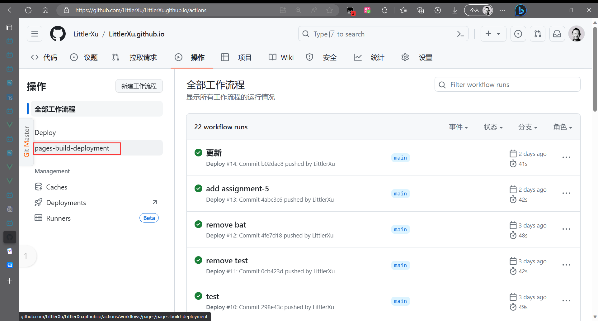

# 如何使用Github Page自动化部署VitePress
将利用VitePress构建的网站部署到[GitHub Pages]([GitHub Pages | Websites for you and your projects, hosted directly from your GitHub repository. Just edit, push, and your changes are live.](https://pages.github.com/))的方法有两种:

- 创建并利用"UserName.github.io"仓库
- 借助"GitHub Actions"

### 创建并利用"UserName.github.io"仓库

1. 创建名称为"UserName.github.io"的仓库

2. 将仓库clone到本地

3. 将打包后的dist文件夹中的文件放入仓库

   >仓库中可以不只有dist文件夹中的文件, 但必须有一个分支的内容仅为dist文件夹中的文件

4. 将dist文件夹中的文件所在分支提交并推送到远程仓库的对应分支(假定远程分支名为"gh-pages")

5. 在Settings->pages界面设置Github Pages的来源分支, 修改为"gh-pages".

6. 之后只需要将此分支的更新推送到远程对应分支即可自动跟新GitHub Pages


### 借助"GitHub Actions"

- 建立一个仓库用于存储VitePress项目的源文件

- 创建一个名为 `deploy.yml` 文件在目录: `/.github/workflows` 中，其中包含如下内容：

  >也可以通过点击: Actions->set up a workflow yourself 来创建action,在点击"commit changes"时选择为免分支创建就行,这两种方式本质上是一样的.

```yaml
# Sample workflow for building and deploying a VitePress site to GitHub Pages
#
name: Deploy VitePress site to Pages

on:
  # Runs on pushes targeting the `main` branch. Change this to `master` if you're
  # using the `master` branch as the default branch.
  push:
    branches: [main]

  # Allows you to run this workflow manually from the Actions tab
  workflow_dispatch:

# Sets permissions of the GITHUB_TOKEN to allow deployment to GitHub Pages
permissions:
  contents: read
  pages: write
  id-token: write

# Allow only one concurrent deployment, skipping runs queued between the run in-progress and latest queued.
# However, do NOT cancel in-progress runs as we want to allow these production deployments to complete.
concurrency:
  group: pages
  cancel-in-progress: false

jobs:
  # Build job
  build:
    runs-on: ubuntu-latest
    steps:
      - name: Checkout
        uses: actions/checkout@v3
        with:
          fetch-depth: 0 # Not needed if lastUpdated is not enabled
      # - uses: pnpm/action-setup@v2 # Uncomment this if you're using pnpm
      # - uses: oven-sh/setup-bun@v1 # Uncomment this if you're using Bun
      - name: Setup Node
        uses: actions/setup-node@v3
        with:
          node-version: 18
          cache: npm # or pnpm / yarn
      - name: Setup Pages
        uses: actions/configure-pages@v3
      - name: Install dependencies
        run: npm ci # or pnpm install / yarn install / bun install
      - name: Build with VitePress
        run: |
          npm run docs:build # or pnpm docs:build / yarn docs:build / bun run docs:build
          touch docs/.vitepress/dist/.nojekyll
      - name: Upload artifact
        uses: actions/upload-pages-artifact@v2
        with:
          path: docs/.vitepress/dist

  # Deployment job
  deploy:
    environment:
      name: github-pages
      url: ${{ steps.deployment.outputs.page_url }}
    needs: build
    runs-on: ubuntu-latest
    name: Deploy
    steps:
      - name: Deploy to GitHub Pages
        id: deployment
        uses: actions/deploy-pages@v2
```

- 之后只需要将更新推送到远程对应分支即可自动更新GitHub Pages

### 对比

这两种方法本质上都是使用了"GitHub Actions":

- 创建"UserName.github.io"仓库时会自动添加一个"pages-build-deployment"actio, 此action会在触发push事件时自动更新pages

  

- 第二种方法则是手动设置action, 推送源文件后触发push事件,利用github的服务器来实现打包并更新pages

**推荐使用第二种方法**

第二种方法有明显的优势: 不用将VitePress打包, 直接将源文件推送即可自动打包和更新.