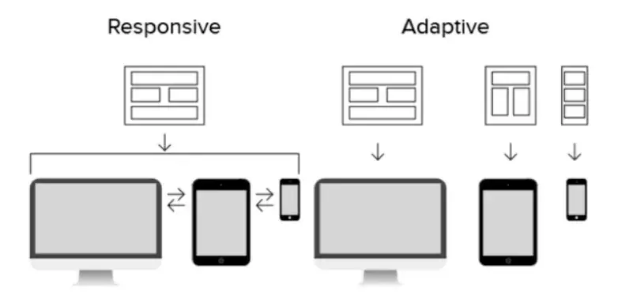
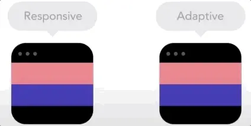
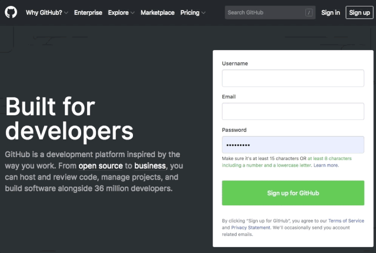
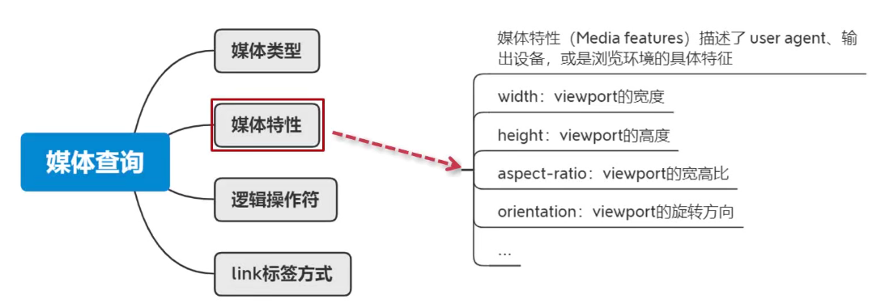
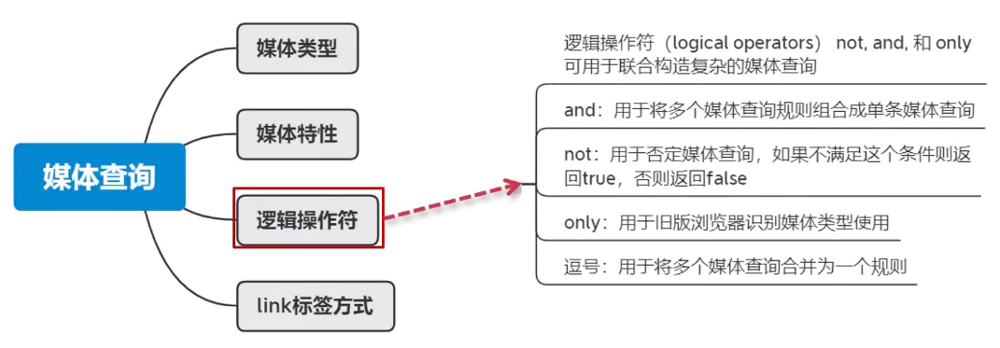
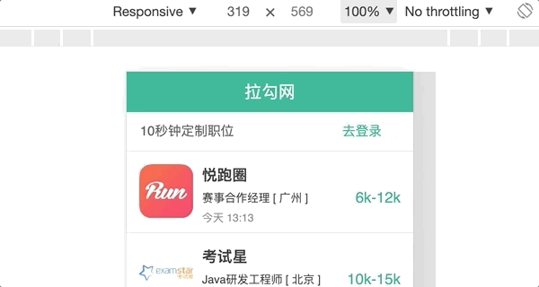
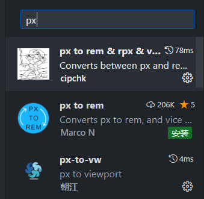
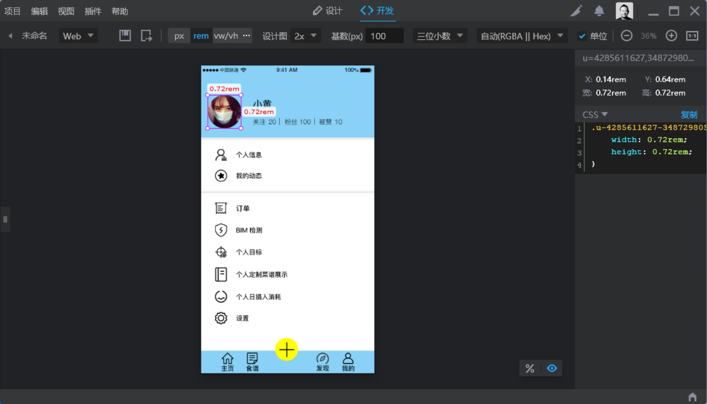

# 移动端及响应式适配
### 简介

运行 web 页面的显示设备，从数十上百英寸的企业大屏到 20 英寸左右的桌面 PC 再到五六英寸的手持智能终端，有各种大小的屏幕类型。

跨屏适配的需求，根据业务类型，一般有两种 UI 设计方案：

●根据屏幕宽度，UI 布局弹性伸缩或流动。这种方式被称为**响应式设计**(*Responsive Design*)；

●把屏幕按宽度范围分为有限的几个区段，为**每个区段定制固定**的 UI，相当于为专门的设备设计专门的 UI。这种方式被称为**自适应设计**(*Adaptive Design*)。





响应式和自适应的区别，国内外各种社区都有很多的讨论，甚至争议。个人认为两种方式更多是一种UI设计层面的区别。技术实现层面，区别并不明显。

响应式。屏幕适配无粒度区分，同一设备上做宽度变化时，内容布局无缝圆滑变化；技术实现通常为，一套代码适配所有屏幕。

自适应。屏幕适配有粒度区分，原则上不做过渡态的 UI 设计，同一设备上做宽度变化时，内容布局卡顿式梯级变化；技术实现通常为，多个屏幕对应多套代码。（演示如下图）



### 响应式

响应式设计方案，常见于 PC、移动等多端共用一套代码的场景。典型的 Web 站点如GitHub（演示见下图）。




浏览这类站点时，随着屏幕的缩小，你会看到页面模块的布局结构在伸缩、流动或显隐变化，文字图片等主体内容在布局容器内流动填充、其大小也一直在做梯级变化。

#### 媒体查询

##### 语法

媒体查询指根据不同的媒体类型（设备类型）和条件来区分各种设备和网页显示区域，并为它们分别定义不同的 CSS 样式。

**媒体类型**

媒体类型用来表示设备的类别

| 媒体类型   | 描述                               |
| ---------- | ---------------------------------- |
| all        | 表示所有的媒体设备                 |
| handheld   | 表示小型手持设备，如手机、平板电脑 |
| print      | 表示打印机                         |
| projection | 表示投影设备                       |
| screen     | 表示电脑显示器                     |
| tv         | 表示电视机类型的设备               |

**媒体特性**



**逻辑操作符**



##### 定义媒体查询

目前可以通过以下两种方式来定义媒体查询：

- 使用 @media 或 @import 规则在样式表中指定对应的设备类型；
- 用 media 属性在 `<style>`、`<link>`、`<source>` 或其他 HTML 元素中指定特定的设备类型。

**@media**

使用 @media 可以指定一组媒体查询和一个 CSS 样式块，当且仅当媒体查询与正在使用的设备匹配时，指定的 CSS 样式才会应用于文档。

```css
/* 在小于或等于 992 像素的屏幕上，将背景色设置为蓝色 */
@media screen and (max-width: 992px) {
	body {
    	background-color: blue;
    }
}

/* 在 600 像素或更小的屏幕上，将背景色设置为橄榄色 */
@media screen and (max-width: 600px) {
	body {
		background-color: olive;
	}
}
```

*@mddia央样式块应当写在样式表(或style标签)的底部, 以保证媒体查询样式的优先级*

**@import**

@import 用来导入指定的外部样式文件并指定目标的媒体类型

```css
@import url("css/screen.css") screen;   /* 引入外部样式，该样式仅会应用于电脑显示器 */@import url("css/print.css") print;     /* 引入外部样式，该样式仅会应用于打印设备 */
body {
    background: #f5f5f5;
	line-height: 1.2;
}
```

==注意：所有 @import 语句都必须出现在样式表的开头，而且在样式表中定义的样式会覆盖导入的外部样式表中冲突的样式。==

**media 属性**

还可以在 `<style>`、`<link>`、`<source>`  等标签的 media 属性中来定义媒体查询，示例代码如下：

```css
/* 当页面宽度大于等于 900 像素时应用该样式 */
<link rel="stylesheet" media="screen and (min-width: 900px)" href="widescreen.css">
/* 当页面宽度小于等于 600 像素时应用该样式 */
<link rel="stylesheet" media="screen and (max-width: 600px)" href="smallscreen.css">
```

*提示：在 media 属性中您还可以指定多种媒体类型，每种媒体类型之间使用逗号进行分隔，例如 media="screen, print"。*

##### 响应断点(阈值)的设定


示例:

```html
<!DOCTYPE html>
<html lang="en">
<head>
    <meta charset="UTF-8">
    <meta http-equiv="X-UA-Compatible" content="IE=edge">
    <meta name="viewport" content="width=device-width, initial-scale=1.0">
    <title>Document</title>
    <style>

        .d-none{
            display: none;
        }
        @media (min-width: 576px){
            .d-sm-none{
                display: none;
            }
        }
        @media (min-width: 768px){
            .d-md-none{
                display: none;
            }
        }
        @media (min-width: 992px){
            .d-lg-none{
                display: none;
            }
        }
        @media (min-width: 1200px){
            .d-xl-none{
                display: none;
            }
        }
        @media (min-width: 1400px){
            .d-xxl-none{
                display: none;
            }
        }

    </style>
</head>
<body>
    <div class="d-none">11111</div>
    <div class="d-sm-none">22222</div>
    <div class="d-md-none">33333</div>
    <div class="d-lg-none">44444</div>
    <div class="d-xl-none">55555</div>
    <div class="d-xxl-none">66666</div>
</body>
</html>
```

##### 断点(阈值)书写原则

- **移动优先**(先编写移动端设备，然后响应式过渡到PC端)

​	媒体特性采用`min-width`,阈值从小到大.

```css
@media (min-width: 700px) {
            .box{
                background: pink;
            }
        }

@media (min-width: 1000px) {
            .box{
                background: green;
            }
 }
```

- **PC端优先**

  媒体查询采用`max-width`,阈值从大到小

```css
@media (max-width: 1000px) {
            .box{
                background: pink;
            }
        }

        @media (max-width: 700px) {
            .box{
                background: green;
            }
        }
```

##### 响应式栅格系统

效果见:慕课网"前端主流布局系统进阶与实战"课程7-5.

```html
<!DOCTYPE html>
<html lang="en">
<head>
    <meta charset="UTF-8">
    <meta http-equiv="X-UA-Compatible" content="IE=edge">
    <meta name="viewport" content="width=device-width, initial-scale=1.0">
    <title>Document</title>
    <style>
        .row{
            background:skyblue;
            display: grid;
            grid-template-columns: repeat(12, 1fr);
            grid-template-rows: 50px;
            grid-auto-rows: 50px;
        }
        .row div{
            background:pink;
            border:1px black solid;
            grid-area: auto/auto/auto/span 12;
        }
        .row .col-1{
            grid-area: auto/auto/auto/span 1;
        }
        .row .col-2{
            grid-area: auto/auto/auto/span 2;
        }
        .row .col-3{
            grid-area: auto/auto/auto/span 3;
        }
        .row .col-4{
            grid-area: auto/auto/auto/span 4;
        }
        .row .col-5{
            grid-area: auto/auto/auto/span 5;
        }
        .row .col-6{
            grid-area: auto/auto/auto/span 6;
        }
        .row .col-7{
            grid-area: auto/auto/auto/span 7;
        }
        .row .col-8{
            grid-area: auto/auto/auto/span 8;
        }
        .row .col-9{
            grid-area: auto/auto/auto/span 9;
        }
        .row .col-10{
            grid-area: auto/auto/auto/span 10;
        }
        .row .col-11{
            grid-area: auto/auto/auto/span 11;
        }
        .row .col-12{
            grid-area: auto/auto/auto/span 12;
        }

        @media (min-width: 576px){
            .row .col-sm-1{
                grid-area: auto/auto/auto/span 1;
            }
            .row .col-sm-2{
                grid-area: auto/auto/auto/span 2;
            }
            .row .col-sm-3{
                grid-area: auto/auto/auto/span 3;
            }
            .row .col-sm-4{
                grid-area: auto/auto/auto/span 4;
            }
            .row .col-sm-5{
                grid-area: auto/auto/auto/span 5;
            }
            .row .col-sm-6{
                grid-area: auto/auto/auto/span 6;
            }
            .row .col-sm-7{
                grid-area: auto/auto/auto/span 7;
            }
            .row .col-sm-8{
                grid-area: auto/auto/auto/span 8;
            }
            .row .col-sm-9{
                grid-area: auto/auto/auto/span 9;
            }
            .row .col-sm-10{
                grid-area: auto/auto/auto/span 10;
            }
            .row .col-sm-11{
                grid-area: auto/auto/auto/span 11;
            }
            .row .col-sm-12{
                grid-area: auto/auto/auto/span 12;
            }
        }

        @media (min-width: 768px){
            .row .col-md-1{
                grid-area: auto/auto/auto/span 1;
            }
            .row .col-md-2{
                grid-area: auto/auto/auto/span 2;
            }
            .row .col-md-3{
                grid-area: auto/auto/auto/span 3;
            }
            .row .col-md-4{
                grid-area: auto/auto/auto/span 4;
            }
            .row .col-md-5{
                grid-area: auto/auto/auto/span 5;
            }
            .row .col-md-6{
                grid-area: auto/auto/auto/span 6;
            }
            .row .col-md-7{
                grid-area: auto/auto/auto/span 7;
            }
            .row .col-md-8{
                grid-area: auto/auto/auto/span 8;
            }
            .row .col-md-9{
                grid-area: auto/auto/auto/span 9;
            }
            .row .col-md-10{
                grid-area: auto/auto/auto/span 10;
            }
            .row .col-md-11{
                grid-area: auto/auto/auto/span 11;
            }
            .row .col-md-12{
                grid-area: auto/auto/auto/span 12;
            }
        }

        @media (min-width: 992px){
            .row .col-lg-1{
                grid-area: auto/auto/auto/span 1;
            }
            .row .col-lg-2{
                grid-area: auto/auto/auto/span 2;
            }
            .row .col-lg-3{
                grid-area: auto/auto/auto/span 3;
            }
            .row .col-lg-4{
                grid-area: auto/auto/auto/span 4;
            }
            .row .col-lg-5{
                grid-area: auto/auto/auto/span 5;
            }
            .row .col-lg-6{
                grid-area: auto/auto/auto/span 6;
            }
            .row .col-lg-7{
                grid-area: auto/auto/auto/span 7;
            }
            .row .col-lg-8{
                grid-area: auto/auto/auto/span 8;
            }
            .row .col-lg-9{
                grid-area: auto/auto/auto/span 9;
            }
            .row .col-lg-10{
                grid-area: auto/auto/auto/span 10;
            }
            .row .col-lg-11{
                grid-area: auto/auto/auto/span 11;
            }
            .row .col-lg-12{
                grid-area: auto/auto/auto/span 12;
            }
        }

        @media (min-width: 1200px){
            .row .col-xl-1{
                grid-area: auto/auto/auto/span 1;
            }
            .row .col-xl-2{
                grid-area: auto/auto/auto/span 2;
            }
            .row .col-xl-3{
                grid-area: auto/auto/auto/span 3;
            }
            .row .col-xl-4{
                grid-area: auto/auto/auto/span 4;
            }
            .row .col-xl-5{
                grid-area: auto/auto/auto/span 5;
            }
            .row .col-xl-6{
                grid-area: auto/auto/auto/span 6;
            }
            .row .col-xl-7{
                grid-area: auto/auto/auto/span 7;
            }
            .row .col-xl-8{
                grid-area: auto/auto/auto/span 8;
            }
            .row .col-xl-9{
                grid-area: auto/auto/auto/span 9;
            }
            .row .col-xl-10{
                grid-area: auto/auto/auto/span 10;
            }
            .row .col-xl-11{
                grid-area: auto/auto/auto/span 11;
            }
            .row .col-xl-12{
                grid-area: auto/auto/auto/span 12;
            }
        }

        @media (min-width: 1400px){
            .row .col-xxl-1{
                grid-area: auto/auto/auto/span 1;
            }
            .row .col-xxl-2{
                grid-area: auto/auto/auto/span 2;
            }
            .row .col-xxl-3{
                grid-area: auto/auto/auto/span 3;
            }
            .row .col-xxl-4{
                grid-area: auto/auto/auto/span 4;
            }
            .row .col-xxl-5{
                grid-area: auto/auto/auto/span 5;
            }
            .row .col-xxl-6{
                grid-area: auto/auto/auto/span 6;
            }
            .row .col-xxl-7{
                grid-area: auto/auto/auto/span 7;
            }
            .row .col-xxl-8{
                grid-area: auto/auto/auto/span 8;
            }
            .row .col-xxl-9{
                grid-area: auto/auto/auto/span 9;
            }
            .row .col-xxl-10{
                grid-area: auto/auto/auto/span 10;
            }
            .row .col-xxl-11{
                grid-area: auto/auto/auto/span 11;
            }
            .row .col-xxl-12{
                grid-area: auto/auto/auto/span 12;
            }
        }
    </style>
</head>
<body>
    <div class="row">
        <div class="col-3">col-3</div>
        <div class="col-3">col-3</div>
        <div class="col-3">col-3</div>
        <div class="col-3">col-3</div>
    </div>
    <div class="row">
        <div class="col-sm-3">col-sm-3</div>
        <div class="col-sm-3">col-sm-3</div>
        <div class="col-sm-3">col-sm-3</div>
        <div class="col-sm-3">col-sm-3</div>
    </div>
    <div class="row">
        <div class="col-md-3">col-md-3</div>
        <div class="col-md-3">col-md-3</div>
        <div class="col-md-3">col-md-3</div>
        <div class="col-md-3">col-md-3</div>
    </div>
    <div class="row">
        <div class="col-lg-3">col-lg-3</div>
        <div class="col-lg-3">col-lg-3</div>
        <div class="col-lg-3">col-lg-3</div>
        <div class="col-lg-3">col-lg-3</div>
    </div>
    <div class="row">
        <div class="col-xl-3">col-xl-3</div>
        <div class="col-xl-3">col-xl-3</div>
        <div class="col-xl-3">col-xl-3</div>
        <div class="col-xl-3">col-xl-3</div>
    </div>
    <div class="row">
        <div class="col-xxl-3">col-xxl-3</div>
        <div class="col-xxl-3">col-xxl-3</div>
        <div class="col-xxl-3">col-xxl-3</div>
        <div class="col-xxl-3">col-xxl-3</div>
    </div>

    <!-- <div class="row">
        <div class="col-xxl-3 col-lg-4 col-sm-6">col</div>
        <div class="col-xxl-3 col-lg-4 col-sm-6">col</div>
        <div class="col-xxl-3 col-lg-4 col-sm-6">col</div>
        <div class="col-xxl-3 col-lg-4 col-sm-6">col</div>
        <div class="col-xxl-3 col-lg-4 col-sm-6">col</div>
        <div class="col-xxl-3 col-lg-4 col-sm-6">col</div>
        <div class="col-xxl-3 col-lg-4 col-sm-6">col</div>
        <div class="col-xxl-3 col-lg-4 col-sm-6">col</div>
        <div class="col-xxl-3 col-lg-4 col-sm-6">col</div>
        <div class="col-xxl-3 col-lg-4 col-sm-6">col</div>
        <div class="col-xxl-3 col-lg-4 col-sm-6">col</div>
        <div class="col-xxl-3 col-lg-4 col-sm-6">col</div>
    </div> -->
</body>
</html>
```

##### 响应式交互实现

效果见:慕课网"前端主流布局系统进阶与实战"课程7-6.

```html
<!DOCTYPE html>
<html lang="en">
<head>
    <meta charset="UTF-8">
    <meta http-equiv="X-UA-Compatible" content="IE=edge">
    <meta name="viewport" content="width=device-width, initial-scale=1.0">
    <title>Document</title>
    <style>
        ul{
            display: none;
        }
        input {
            display: none;
        }
        input:checked + ul{
            display: block;
        }

        @media (min-width: 700px){
            ul{
                display: block;
            }
            span{
                display: none;
            }
        }
    </style>
</head>
<body>
    <label for="menu">
        <span>
            菜单按钮
        </span>
    </label>
    <input id="menu" type="checkbox">
    <ul>
        <li>首页</li>
        <li>教程</li>
        <li>论坛</li>
        <li>文章</li>
    </ul>
</body>
</html>
```

##### 响应式框架Bootstrap

&emsp;&emsp;Bootstrap是最受欢迎的 HTML、CSS 和 JS 框架，用于开发响应式布局、移动设备优先的WEB项目。

&emsp;&emsp;在前面视频教程中提到的，响应断点、栅格系统、交互实现等内容，在Bootstrap框架中都已经提供好了，只需要引入框架文件即可使用。

&emsp;&emsp;Bootstrap文件可通过官方提供的网址：[https://getbootstrap.com/](https://getbootstrap.com/) 进行下载。截止到目前最新的版本为 v5.0.x 。这里强调一点，Bootstrap框架是基于jquery库来设计的，所以除了在html文件中引入Bootstrap相关文件外，还需要引入jquery.js文件，并需要确保文件的引入顺序，具体引入方式如下：

```html
<link rel="stylesheet" href="./bootstrap.css">
<script src="./jquery.js"></script>
<script src="./bootstrap.js"></script>
```

###### 响应式断点的设定

&emsp;&emsp;Bootstrap中的断点值设定跟前面视频中讲解的值是一样的：

| 设备描述    | 断点值  | 标识符 |
| ----------- | ------- | ------ |
| Extra small | <576px  |        |
| Small       | ≥576px  | -sm    |
| Medium      | ≥768px  | -md    |
| Large       | ≥992px  | -lg    |
| X-Large     | ≥1200px | -xl    |
| XX-Large    | ≥1400px | -xxl   |

&emsp;&emsp;在Bootstrap框架中，能够具备响应式断点设定的样式非常多，如：float浮动、display显示框、container容器、text文本等。

```html
<div class="float-sm-start
            d-lg-block
            container-md
            text-xl-start"></div>
```

###### 响应式栅格系统

&emsp;&emsp;Bootstrap中的栅格系统跟前面视频中讲解的也是一样的，不过功能更加的丰富，除了有12列响应式栅格系统外，还有栅格位置的控制和对行的栅格化控制等。

&emsp;&emsp;可通过 `offset-*-*` 模式对栅格进行偏移，代码如下：

```html
<div class="row">
    <div class="col-3 offset-1 bg-primary p-4"></div>
    <div class="col-3 offset-2 bg-danger p-4"></div>
</div>
```


&emsp;&emsp;可以看到第一列距离左边会空出一个栅格的大小，第二列跟第一列之间会空出两个栅格的大小，那么最后剩余的空间为三个栅格。

&emsp;&emsp;可通过 `row-*-*` 模式对行进行栅格化控制，代码如下：

```html
<div class="row row-cols-3">
    <div class="col bg-primary p-4 border"></div>
    <div class="col bg-primary p-4 border"></div>
    <div class="col bg-primary p-4 border"></div>
    <div class="col bg-primary p-4 border"></div>
</div>
<div class="row row-cols-4">
    <div class="col bg-danger p-4 border"></div>
    <div class="col bg-danger p-4 border"></div>
    <div class="col bg-danger p-4 border"></div>
    <div class="col bg-danger p-4 border"></div>
</div>
```


&emsp;&emsp;可以看到第一行只能放置三列，而第二行可以放置四列。

###### 常见bootstrap组件

&emsp;&emsp;在Bootstrap框架中提供了很多现成的组件，可直接进行使用并带有交互行为。下面展示其中一个组件，Accordion(手风琴，即折叠列表)组件。

```html
<div class="accordion" id="accordionExample">
    <div class="accordion-item">
        <h2 class="accordion-header" id="headingOne">
            <button class="accordion-button" type="button" data-bs-toggle="collapse" data-bs-target="#collapseOne" aria-expanded="true" aria-controls="collapseOne">
            第一项
            </button>
        </h2>
        <div id="collapseOne" class="accordion-collapse collapse show" aria-labelledby="headingOne" data-bs-parent="#accordionExample">
            <div class="accordion-body">
                第一项的内容
            </div>
        </div>
    </div>
    <div class="accordion-item">
        <h2 class="accordion-header" id="headingTwo">
            <button class="accordion-button collapsed" type="button" data-bs-toggle="collapse" data-bs-target="#collapseTwo" aria-expanded="false" aria-controls="collapseTwo">
            第二项
            </button>
        </h2>
        <div id="collapseTwo" class="accordion-collapse collapse" aria-labelledby="headingTwo" data-bs-parent="#accordionExample">
            <div class="accordion-body">
                第二项的内容
            </div>
        </div>
    </div>
</div>
```


&emsp;&emsp;Bootstrap中的组件是通过，自定义属性 `data-*` 方式来控制交互行为的，例如在Accordion组件中通过 `data-bs-toggle="collapse" data-bs-target="#collapseOne"` 进行的。

### 自适应

为了在特定设备上实现最好的用户体验，越来越多的产品，开始针对特定屏幕设计固定的 UI，绝大多数移动端产品都有了区分于 PC 的专门的m站。

其技术实现通常为：服务器根据浏览器请求的 user-agent 判断设备类型，然后返回(或重定向)对应的站点内容。


移动端的屏幕宽度差距比较小（4-8 英寸），UI 页面通常也会保持一致的布局方式，只是文字、图标、大图片等可能会根据业务需要做一些定制化的处理。

>注：Pad 设备虽然也是移动设备，但是因为屏幕足够宽，所以现在多数产品（如某宝）的方案都是访问 PC 站点了。

移动端多屏适配的需求，常见主要有两类：

1、布局伸缩式（布局伸缩，内容大小固定或梯级变化）；

2、等比缩放式（布局和内容完全等比例缩放）。


#### 布局伸缩式



如上图，布局伸缩式适配需求，常见于排版比较简单的信息流展示类业务。

其布局特点一般为横向伸缩，竖向高度固定或由内容填充决定；文字图标等网页内容一般会固定大小或梯级变化，且在宽屏窄屏上的视觉大小保持一致。

**技术方案**:

- 设置 viewport 宽度为 device-width，以保证 px 为单位取值的一些文字图标等网页内容视觉大小符合预期且宽窄屏大小一致。（css 中的 px 取值需按一倍屏 UI 稿来写）；

- 布局方案灵活使用相对单位%/float/flex 等，以保证布局的横向伸缩和容器内各元素的大小间距符合预期；

- 组合包裹相关元素，并相对某一方向做定位，以保证宽度变化时的定位稳定。

2、等比缩放式（布局和内容完全等比例缩放）。

https://vdn6.vzuu.com/SD/b9483892-23b4-11eb-83b9-32fc2f8fd721.mp4?pkey=AAVLOrTbpl1GA6JsO5XNf3yh9pJbjszSK2GKvgUaZZfQVoozl2dLPWpcM9XP9V9hGYF0YYHwdMnL8frCHMLSKhX9&c=avc.0.0&f=mp4&pu=078babd7&bu=078babd7&expiration=1693366664&v=ks6

如上图，等比缩放式适配需求，广泛应用于各种产品类、运营类等业务场景。

其布局特点简单粗暴，就是根据屏幕宽度整个页面等比缩放。

>注：实际业务中的适配需求可能是区分页面模块做混搭的.

#### 等比缩放式

##### rem

●设置 viewport 宽度为 device-width 或其他固定值，以得到 px 为单位的文字、图标或边线等期望的渲染效果

●css 单位使用 rem，根据 viewport 宽度以及 css 中 rem 的换算系数，动态计算并设置 html 根节点 font-size，以实现整个页面内容的等比例缩放

动态计算`font-size`有两种方法:利用JS动态计算(flexible.js库)和利用vw相对单位换算

利用vw进行动态换算是较优方案:

```css
html {
    font-size: 26.666667vw;
}
body {
    font-size: 0.16rem;
}
```

`font-size`值通常设为26.666667vw, 这样在逻辑像素总宽度为375px*667px的设计稿中(设计稿通常是这个尺寸,不是这个尺寸时自行换算即可),1rem正好为换算为100px,方便后续将元素的px换算为rem.

>由于`font-size`属性的可继承性,在修改了根元素的font-size属性之后,需要设置body元素的font-size属性以重置继承链中的font-size大小.
>
>如果想要字体大小也等比缩放, 可以将body中`font-size`也设为rem单位, 值通常为1,6px对应的rem大小, 在rem大小为26.666667vw时值为0.16rem.

>注：一些文本段落展示类的需求，UI 设计师可能会希望宽屏比窄屏在一行内可以展示更多的文字。这时就需要引入媒体查询，并且对字号使用 px 单位做特殊处理。

##### vw

1vw 即表示当前视口宽度的 1%，我们可以利用这一点替代“rem+根节点 font-size”的等比缩放实现。

举个例子，750px 的 UI 稿中，宽度 75px 的按钮，在 css 中的宽度描述即为：width:10vw。

##### 直接把 web 容器视口的大小定为和 UI 稿一样的 px 大小

适用于页面整体完全是等比缩放式.[详情](https://zhuanlan.zhihu.com/p/91777193?utm_id=0#:~:text=6.2.3%20%E6%8A%80%E6%9C%AF%E6%96%B9%E6%A1%88%20%2D%20viewport%20meta%20only)

### 软件和插件

#### pxtorem-vscode插件



这几个插件都是可以将所书写的css的px长度单位自动转换为rem、vw等移动端常用长度单位.

#### PxCook



PxCook用于方便地测量设计稿中的尺寸,并且可以将设计稿中的px直接改为rem、vw等单位.