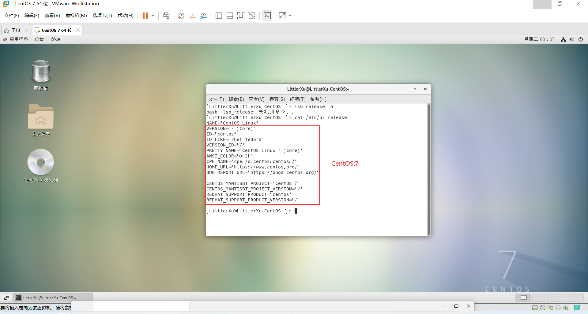

# 作业一

## 安装一个Linux/UNIX操作系统(推荐 虚拟机安装CentOS-7)
打开虚拟机并登录到操作系统。

打开终端，输入以下命令：
```bash
cat /etc/os-release
```
结果显示:

表示安装的操作系统为CentOS-7

## 从身边（可以通过网络）了解你认识的 UNIX/Linux，特别是鸿蒙和欧拉.
### UNIX/Linux
维基百科关于UNIX/Linux的系统介绍:
 [UNIX/Linux-wikipedia](https://zh.wikipedia.org/zh-tw/Linux)

### 鸿蒙
鸿蒙（即HarmonyOS，开发代号Ark，正式名称为华为终端鸿蒙智能设备操作系统软件）是华为公司自2012年以来开发的一款可支持鸿蒙原生应用和兼容AOSP应用的分布式操作系统。该系统利用“分布式”技术，将手机、电脑、平板、电视、汽车和智慧穿戴等多款设备融合成一个“超级终端”，使用户便于操作和共享各种设备的资源。

华为于2019年8月正式发布了HarmonyOS。

**系统架构**

鸿蒙系统架构支持多内核，包括Linux内核、LiteOS和鸿蒙微内核，可按各种智能设备选择所需内核，例如在低功耗设备上使用LiteOS内核。

系统的内核抽象层可以支持多内核。在手机、平板以及PC等大内存设备上，系统采用Linux内核和OpenHarmony框架以运行鸿蒙应用程序，同时利用AOSP框架以运行安卓应用。在手表及物联网相关设备上，系统采用LiteOS内核以运行轻量的鸿蒙应用程序。

鸿蒙系统的通信基座使用“分布式软总线”技术联通多款设备，可以集成一个虚拟的“超级终端”，允许一个设备控制其他设备，及共享分布在各款设备的数据资源。为了解决不同设备带来的安全问题，鸿蒙系统提供了基于硬件的可信执行环境，以防止敏感个人数据在存储或处理时泄露。

该系统支持多种形式的应用程序，包括在“华为应用市场”下载和安装的应用程序，及免安装的“快应用”和便捷的“元服务”（旧称“原子化”服务）。元服务可由用户在系统内搜寻“服务卡片”后启动或碰一碰设备直接启动。
### 欧拉
EulerOS，又称为欧拉操作系统，是华为基于CentOS源代码，面向企业应用环境开发的一个商用Linux发行版。

**特点**

EulerOS支持鲲鹏处理器、容器虚拟化技术，是一个面向企业级的通用服务器架构平台。应用场景包括TaiShan服务器、PaaS和企业存储三类。

EulerOS有三级智能调度，可以智能自动有规划。EulerOS对ARM64架构提供全栈支持，打造从芯片到应用的一体化生态系统。

**发展**

2019年9月，华为宣布EulerOS开源，开源名称为openEuler（开源欧拉）。华为在Gitee上附源代码发布EulerOS的社区版本openEuler。2021年11月初，华为向开放原子开源基金会（OpenAtom Foundation）捐赠了openEuler。