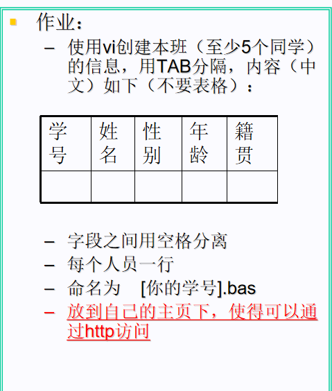
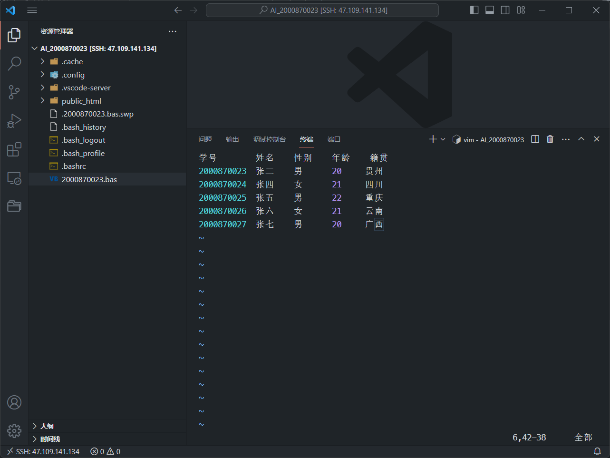
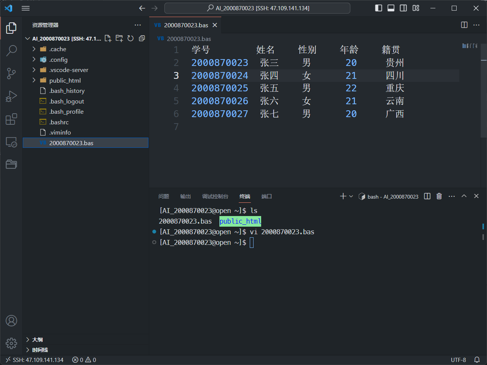

# 作业三
要求:



远程连接主机,进入个人目录(AI_2000870023/),

新建2000870023.bas文件:

```bash
touch 2000870023.bas
```
使用vi编辑器编辑此文件:
```bash
vi 2000870023.bas
```
编辑内容如下:

编辑完成后保存并退出编辑器:
```bash
:wq
```
查看2000870023.bas文件内容,显示:

可见已编辑并保存成功.