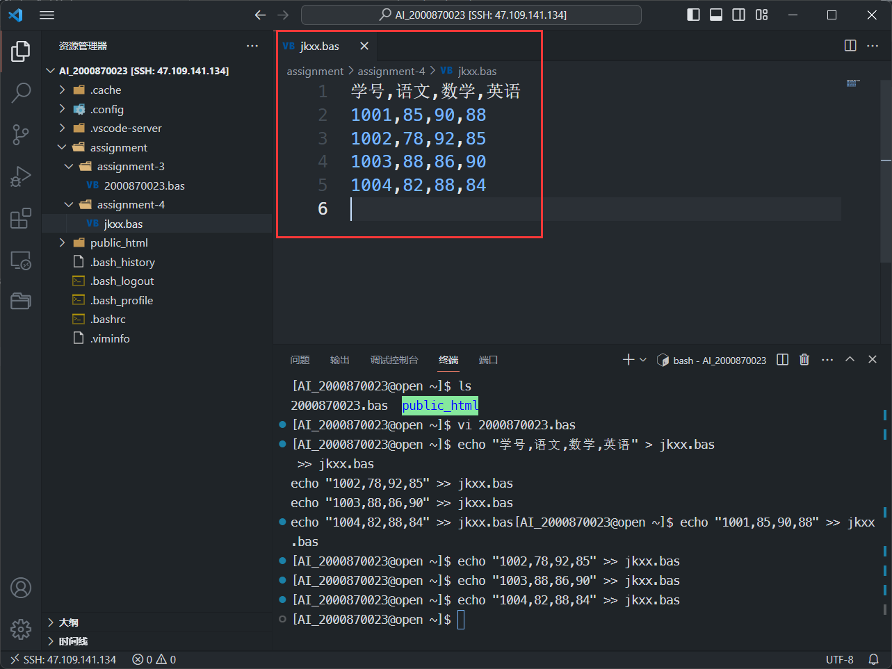
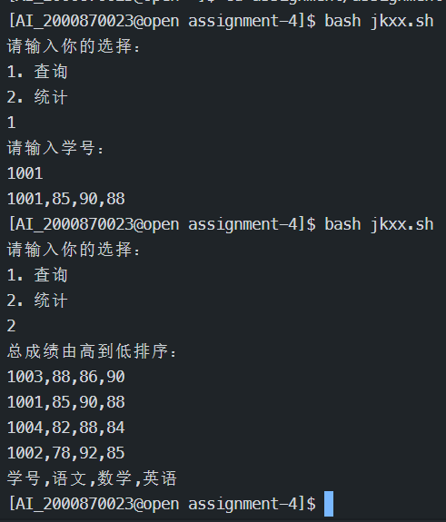

# 作业四
> **要求**
>
> 编写一shell程序，命名为针对班级成绩表
> jkxx.bas，完成如下功能:
> - 查询:输入学号，输出该学号学生的各科成绩
> - 统计:按总成绩由高到低的顺序，输出本班同学
> 成绩(优，良，中，及格，不及格分别按
> 90,80,70,60,50计算)

首先,创建成绩表jkxx.bas:
```bash
echo "学号,语文,数学,英语" > jkxx.bas
echo "1001,85,90,88" >> jkxx.bas
echo "1002,78,92,85" >> jkxx.bas
echo "1003,88,86,90" >> jkxx.bas
echo "1004,82,88,84" >> jkxx.bas
```
结果:


shell脚本:
```bash
#!/bin/bash

echo "请输入你的选择："
echo "1. 查询"
echo "2. 统计"
read choice

case $choice in
1)
    echo "请输入学号："
    read id
    grep "^$id" jkxx.bas
    ;;
2)
    echo "总成绩由高到低排序："
    sort -t',' -k2 -nr jkxx.bas
    ;;
*)
    echo "无效的选择"
    ;;
esac
```
脚本运行演示:


> 注: 表格所在文件jkxx.bas以及基本源文件jkxx.sh均存放在"~/assignment/assignment-4"目录下