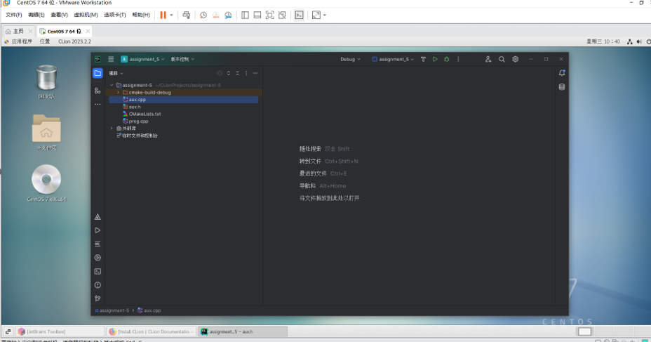
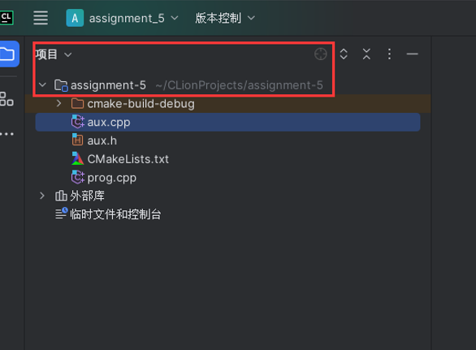
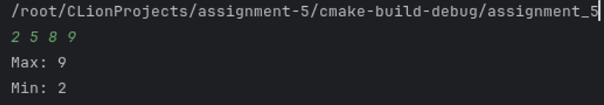

# 作业五
## 要求:
在自己安装的Linux系统上，安装C++集成开发环境Anjuta、Kdevelop、Code::Blocks之一；

在该开发环境中，创建一项目：
- 2个cpp文件：prog.cpp， aux.cpp
- 1个h文件：aux.h
aux.h头文件定义函数Max和Min

它们分别计算四个数（参数）的最大值和最小值；
aux.cpp实现这两个函数
prog.c中定义主函数，循环输入4个数，输出他们的最大和最小值
编译该项目，调试、跟踪程序执行过程；并在控制台界面运行编译的可执行文件。

## 步骤:

下载的IDE为: Clion


创建项目:
项目名称为assignment-5

2个cpp文件：
prog.cpp:
```c
#include <iostream>
#include "aux.h"

int main() {
    int a, b, c, d;
    while (std::cin >> a >> b >> c >> d) {
        std::cout << "Max: " << Max(a, b, c, d) << std::endl;
        std::cout << "Min: " << Min(a, b, c, d) << std::endl;
    }
    return 0;
}
```

aux.cpp
```c
#include "aux.h"
#include <algorithm>

int Max(int a, int b, int c, int d) {
    return std::max({a, b, c, d});
}

int Min(int a, int b, int c, int d) {
    return std::min({a, b, c, d});
}
```

1个h文件：aux.h
```h
#ifndef AUX_H
#define AUX_H

int Max(int a, int b, int c, int d);
int Min(int a, int b, int c, int d);

#endif
```

运行:

