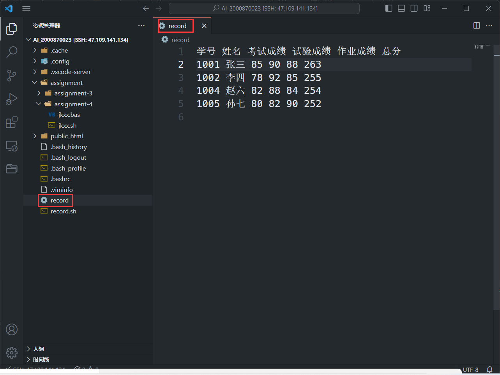

# 实验二: Shell程序设计
1. 实验目的

了解常用shell 的编程特点，掌握 shell 程序设计的基础知识。对 shell 程序流程控制、shell
程序运行方式、bash 程序的调试方法及 bash 的常用内部命令又进一步的认识和理解。通过
本实验，应基本掌握编写 shell 程序的步骤、方法和技巧。

2. 实验内容

在 Linux B-shell 下，使用函数模块建立一个 shell 程序 record.sh，用来存储和查询学生成
绩，并提供菜单显示选项；同时可以根据用户输入的选项来执行查询、添加、计算总分、统
计平均分等功能。另外，要求自己建立本组学生姓名和成绩信息，并保存在当前$HOME 目
录的 record 文件中，文件中的每一行记录了一个学生的信息。
学生信息包括：

学号 姓名 考试成绩 试验成绩 作业成绩 总分（第一行）

（其中，除了“总分”，通过计算而得到外，其他通过输入得到。各个域之间用 tab 分
隔；总分=考试成绩+试验成绩+作业成绩）

3. 实验步骤

创建~/record文件:
```bash
echo "学号 姓名 考试成绩 试验成绩 作业成绩 总分" > ~/record
echo "1001 张三 85 90 88 263" >> ~/record
echo "1002 李四 78 92 85 255" >> ~/record
echo "1003 王五 88 86 90 264" >> ~/record
echo "1004 赵六 82 88 84 254" >> ~/record
```
结果:


编写shell脚本并保存至~/record.sh文件中:
脚本源码:
```bash
record_file=~/record

echo "请选择你的操作："
echo "1. 查询"
echo "2. 添加"
echo "3. 删除"
echo "4. 显示所有记录"
echo "5. 统计总分和计算平均分"
read choice

case $choice in
1)
    echo "请输入学号："
    read id
    grep "^$id" $record_file
    ;;
2)
    echo "请输入学生信息（格式：学号 姓名 考试成绩 试验成绩 作业成绩）："
    read id name exam_score test_score homework_score
    total_score=$((exam_score + test_score + homework_score))
    echo "$id $name $exam_score $test_score $homework_score $total_score" >> $record_file
    ;;
3)
    echo "请输入要删除的学生的学号："
    read id
    sed -i "/^$id/d" $record_file
    ;;
4)
    cat $record_file
    ;;
5)
    total_score=0
    total_students=0
    while read -r line
    do
        score=$(echo $line | awk '{print $6}')
        if [[ $score =~ ^[0-9]+$ ]] ; then
            total_score=$((total_score + score))
            total_students=$((total_students + 1))
        fi
    done < $record_file
    if [ $total_students -gt 0 ]; then
        average_score=$((total_score / total_students))
        echo "总分：$total_score"
        echo "平均分：$average_score"
    else
        echo "没有学生记录"
    fi
    ;;
*)
    echo "无效的选择"
    ;;
esac
```
脚本执行演示:
```bash
[AI_2000870023@open ~]$ bash record.sh
请选择你的操作：
1. 查询
2. 添加
3. 删除
4. 显示所有记录
5. 统计总分和计算平均分
1
请输入学号：
1001
1001 张三 85 90 88 85
[AI_2000870023@open ~]$ bash record.sh
请选择你的操作：
1. 查询
2. 添加
3. 删除
4. 显示所有记录
5. 统计总分和计算平均分
2
请输入学生信息（格式：学号 姓名 考试成绩 试验成绩 作业成绩）：
1005 孙七 80 82 90
[AI_2000870023@open ~]$ bash record.sh
请选择你的操作：
1. 查询
2. 添加
3. 删除
4. 显示所有记录
5. 统计总分和计算平均分
3
请输入要删除的学生的学号：
1003
[AI_2000870023@open ~]$ bash record.sh
请选择你的操作：
1. 查询
2. 添加
3. 删除
4. 显示所有记录
5. 统计总分和计算平均分
4
学号 姓名 考试成绩 试验成绩 作业成绩 总分
1001 张三 85 90 88 85
1002 李四 78 92 85 255
1004 赵六 82 88 84 254
1005 孙七 80 82 90 252
[AI_2000870023@open ~]$ bash record.sh
请选择你的操作：
1. 查询
2. 添加
3. 删除
4. 显示所有记录
5. 统计总分和计算平均分
5
总分：1024
平均分：256
[AI_2000870023@open ~]$
```