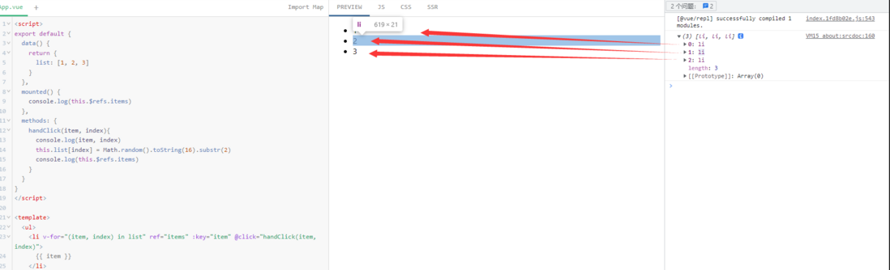
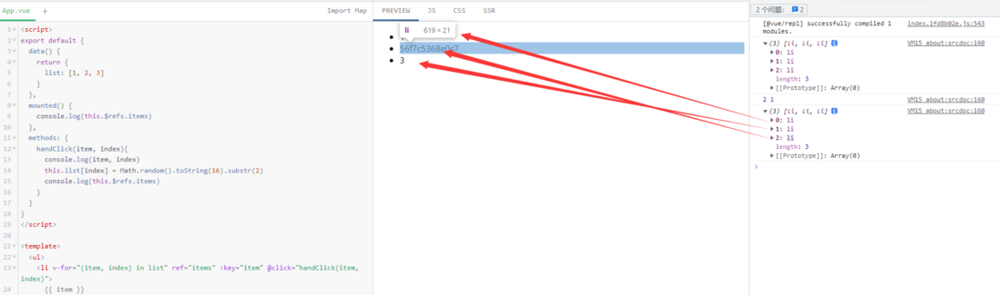
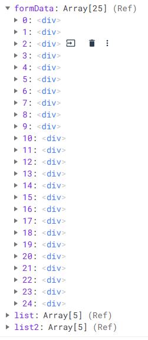
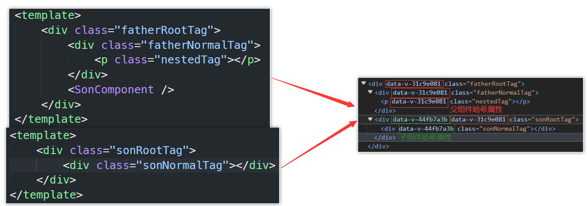
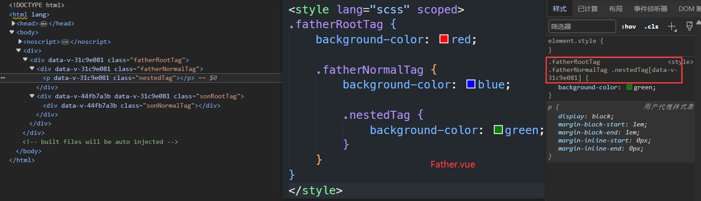
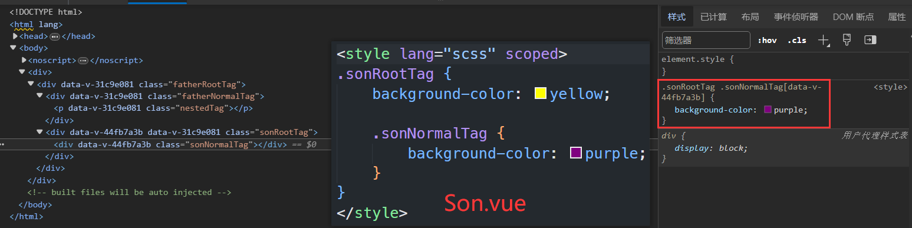
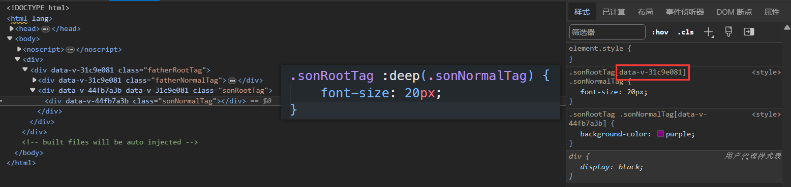
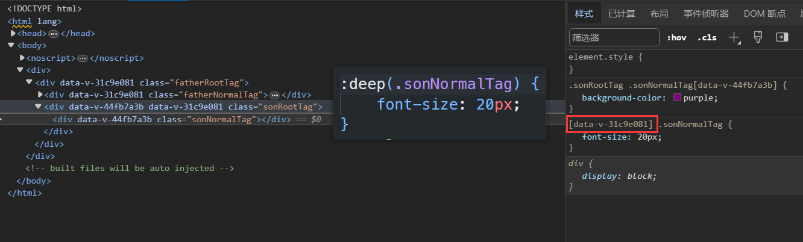
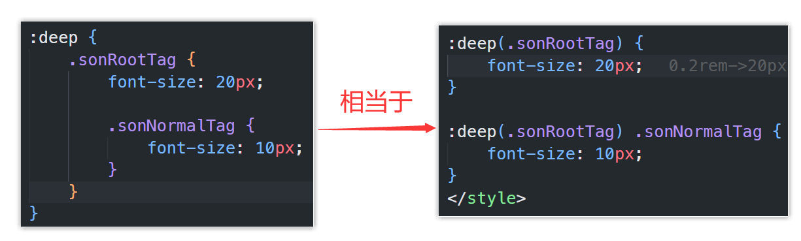

# 创建Vue3工程

## 基于 vue-cli 创建

点击查看[官方文档](https://cli.vuejs.org/zh/guide/creating-a-project.html#vue-create)

 备注：目前`vue-cli`已处于维护模式，官方推荐基于 `Vite` 创建项目。

```powershell
## 查看@vue/cli版本，确保@vue/cli版本在4.5.0以上
vue --version

## 安装或者升级你的@vue/cli
npm install -g @vue/cli

## 执行创建命令
vue create vue_test

##  随后选择3.x
##  Choose a version of Vue.js that you want to start the project with (Use arrow keys)
##   3.x
##    2.x

## 启动
cd vue_test
npm run serve
```

---

##  [基于 vite 创建](推荐)

`vite` 是新一代前端构建工具，官网地址：[https://vitejs.cn](https://vitejs.cn/)，`vite`的优势如下：

- 轻量快速的热重载（`HMR`），能实现极速的服务启动。
- 对 `TypeScript`、`JSX`、`CSS` 等支持开箱即用。
- 真正的按需编译，不再等待整个应用编译完成。
- `webpack`构建 与 `vite`构建对比图如下：
  img src="Vue3.assets/1683167182037-71c78210-8217-4e7d-9a83-e463035efbbe.png" alt="webpack构建" title="webpack构建" style="zoom:20%;box-shadow:0 0 10px black" /	img src="E:/百度网盘下载/资料/images/1683167204081-582dc237-72bc-499e-9589-2cdfd452e62f.png" alt="vite构建" title="vite构建" style="zoom: 20%;box-shadow:0 0 10px black" /

* 具体操作如下（点击查看[官方文档](https://cn.vuejs.org/guide/quick-start.html#creating-a-vue-application)）

```powershell
## 1.创建命令
npm create vue@latest

## 2.具体配置
## 配置项目名称
√ Project name: vue3_test
## 是否添加TypeScript支持
√ Add TypeScript?  Yes
## 是否添加JSX支持
√ Add JSX Support?  No
## 是否添加路由环境
√ Add Vue Router for Single Page Application development?  No
## 是否添加pinia环境
√ Add Pinia for state management?  No
## 是否添加单元测试
√ Add Vitest for Unit Testing?  No
## 是否添加端到端测试方案
√ Add an End-to-End Testing Solution? » No
## 是否添加ESLint语法检查
√ Add ESLint for code quality?  Yes
## 是否添加Prettiert代码格式化
√ Add Prettier for code formatting?  No
```

安装官方推荐的`vscode`插件：

img src="Vue3.assets/volar.png" alt="Snipaste_2023-10-08_20-46-34" style="zoom:50%;" /

img src="Vue3.assets/image-20231218085906380.png" alt="image-20231218085906380" style="zoom:42%;" /

提示：

- `Vite` 项目中，`index.html` 是项目的入口文件，在项目顶层。
- 加载`index.html`后，`Vite` 解析 `script type="module" src="xxx"` 指向的`JavaScript`。
- `Vue3`**中是通过 **`createApp` 函数创建一个应用实例。

# Vue3核心语法

## OptionsAPI 与 CompositionAPI

- `Vue2`的`API`设计是`Options`（配置）风格的。
- `Vue3`的`API`设计是`Composition`（组合）风格的。

###  Options API 的弊端

`Options`类型的 `API`，数据、方法、计算属性等，是分散在：`data`、`methods`、`computed`中的，若想新增或者修改一个需求，就需要分别修改：`data`、`methods`、`computed`，不便于维护和复用。

img src="E:/百度网盘下载/资料/images/1696662197101-55d2b251-f6e5-47f4-b3f1-d8531bbf9279.gif" alt="1.gif" style="zoom:70%;border-radius:20px" /img src="Vue3.assets/1696662200734-1bad8249-d7a2-423e-a3c3-ab4c110628be.gif" alt="2.gif" style="zoom:70%;border-radius:20px" /

### Composition API 的优势

可以用函数的方式，更加优雅的组织代码，让相关功能的代码更加有序的组织在一起。

img src="Vue3.assets/1696662249851-db6403a1-acb5-481a-88e0-e1e34d2ef53a.gif" alt="3.gif" style="height:300px;border-radius:10px"  /img src="E:/百度网盘下载/资料/images/1696662256560-7239b9f9-a770-43c1-9386-6cc12ef1e9c0.gif" alt="4.gif" style="height:300px;border-radius:10px"  /

 说明：以上四张动图原创作者：大帅老猿(掘金)

## setup()与\script setup

### setup()

`setup()` 钩子是在组件中使用组合式 API 的入口，通常只在以下情况下使用：

1. 需要在非单文件组件中使用组合式 API 时。
2. 需要在基于选项式 API 的组件中集成基于组合式 API 的代码时。

注意

对于结合单文件组件使用的组合式 API，推荐通过\script setup以获得更加简洁及符合人体工程学的语法。

可以使用响应式API来声明响应式的状态，在 `setup()` 函数中返回的对象会暴露给模板和组件实例。其他的选项也可以通过组件实例来获取 `setup()` 暴露的属性：

```vue
script
import  ref  from 'vue'

export default
  setup()
    const count = ref(0)

    // 返回值会暴露给模板和其他的选项式 API 钩子
    return
      count

  ,

  mounted()
    console.log(this.count) // 0


/script

template
  button @click="count++" count /button
/template
```

提示:

- 在模板中访问从 `setup` 返回的ref时，它会[自动浅层解包](https://cn.vuejs.org/guide/essentials/reactivity-fundamentals.html#caveat-when-unwrapping-in-templates)，因此无须再在模板中为它写 `.value`。当通过 `this` 访问时也会同样如此解包。

- `setup()` 自身并不含对组件实例的访问权，即在 `setup()` 中访问 `this` 会是 `undefined`。可以在选项式 API 中访问组合式 API 暴露的值，但反过来则不行。

- `setup()` 应该*同步地*返回一个对象。唯一可以使用 `async setup()` 的情况是，该组件是 [Suspense](https://cn.vuejs.org/guide/built-ins/suspense.html) 组件的后裔。

**访问 Props**

`setup` 函数的第一个参数是组件的 `props`。和标准的组件一致，一个 `setup` 函数的 `props` 是响应式的，并且会在传入新的 props 时同步更新。

```js
export default
  props:
    title: String
  ,
  setup(props)
    console.log(props.title)


```

请注意如果你解构了 `props` 对象，解构出的变量将会丢失响应性。因此我们推荐通过 `props.xxx` 的形式来使用其中的 props。

如果你确实需要解构 `props` 对象，或者需要将某个 prop 传到一个外部函数中并保持响应性，那么你可以使用 [toRefs()](https://cn.vuejs.org/api/reactivity-utilities.html#torefs) 和 [toRef()](https://cn.vuejs.org/api/reactivity-utilities.html#toref) 这两个工具函数：

```js
import  toRefs, toRef  from 'vue'

export default
  setup(props)
    // 将 `props` 转为一个其中全是 ref 的对象，然后解构
    const  title  = toRefs(props)
    // `title` 是一个追踪着 `props.title` 的 ref
    console.log(title.value)

    // 或者，将 `props` 的单个属性转为一个 ref
    const title = toRef(props, 'title')


```

**Setup 上下文**

传入 `setup` 函数的第二个参数是一个Setup上下文对象。上下文对象暴露了其他一些在 `setup` 中可能会用到的值：

```js
export default
  setup(props, context)
    // 透传 Attributes（非响应式的对象，等价于 $attrs）
    console.log(context.attrs)

    // 插槽（非响应式的对象，等价于 $slots）
    console.log(context.slots)

    // 触发事件（函数，等价于 $emit）
    console.log(context.emit)

    // 暴露公共属性（函数）
    console.log(context.expose)


```

该上下文对象是非响应式的，可以安全地解构：

```js
export default
  setup(props,  attrs, slots, emit, expose )
    ...


```

`attrs` 和 `slots` 都是有状态的对象，它们总是会随着组件自身的更新而更新。这意味着你应当避免解构它们，并始终通过 `attrs.x` 或 `slots.x` 的形式使用其中的属性。

此外还需注意，和 `props` 不同，`attrs` 和 `slots` 的属性都**不是**响应式的。如果你想要基于 `attrs` 或 `slots` 的改变来执行副作用，那么你应该在 `onBeforeUpdate` 生命周期钩子中编写相关逻辑。

### \script setup

script setup 是在单文件组件 (SFC) 中使用组合式 API 的编译时语法糖。当同时使用 SFC 与组合式 API 时该语法是默认推荐。相比于普通的 script 语法，它具有更多优势：

- 更少的样板内容，更简洁的代码。
- 能够使用纯 TypeScript 声明 props 和自定义事件。
- 更好的运行时性能 (其模板会被编译成同一作用域内的渲染函数，避免了渲染上下文代理对象)。
- 更好的 IDE 类型推导性能 (减少了语言服务器从代码中抽取类型的工作)。

#### 基本语法

要启用该语法，需要在 `script` 代码块上添加 `setup` attribute：

```vue
script setup
console.log('hello script setup')
/script
```

里面的代码会被编译成组件 `setup()` 函数的内容。这意味着与普通的 `script` 只在组件被首次引入的时候执行一次不同，`script setup` 中的代码会在每次组件实例被创建的时候执行。

#### 顶层的绑定会被暴露给模板

当使用 `script setup` 的时候，任何在 `script setup` 声明的顶层的绑定 (包括变量，函数声明，以及 import 导入的内容) 都能在模板中直接使用：

```vue
script setup
//导入的组件
import MyComponent from './MyComponent.vue'

//导入的函数
import  capitalize  from './helpers'

// 变量
const msg = 'Hello!'

// 函数
function log()
  console.log(msg)

/script

template
  MyComponent /
  div capitalize('hello') /div
  button @click="log" msg /button
/template
```

import 导入的内容也会以同样的方式暴露。

```vue
script setup

/script

template
  div capitalize('hello') /div
/template
```

#### 响应式

响应式状态需要明确使用[响应式 API](https://cn.vuejs.org/api/reactivity-core.html) 来创建。和 `setup()` 函数的返回值一样，ref 在模板中使用的时候会自动解包：

```vue
script setup
import  ref  from 'vue'

const count = ref(0)
/script

template
  button @click="count++" count /button
/template
```


#### defineProps() 和 defineEmits()

为了在声明 `props` 和 `emits` 选项时获得完整的类型推导支持，我们可以使用 `defineProps` 和 `defineEmits` API，它们将自动地在 `script setup` 中可用：

```vue
script setup
const props = defineProps(
  foo: String
)

const emit = defineEmits(['change', 'delete'])
// setup 代码
/script
```

- **`defineProps` 接收与 `props` 选项相同的值，`defineEmits` 接收与 `emits` 选项相同的值。**
- `defineProps` 和 `defineEmits` 都是只能在 `script setup` 中使用的**编译器宏**。他们不需要导入，且会随着 `script setup` 的处理过程一同被编译掉。
- `defineProps` 和 `defineEmits` 在选项传入后，会提供恰当的类型推导。
- 传入到 `defineProps` 和 `defineEmits` 的选项会从 setup 中提升到模块的作用域。因此，传入的选项不能引用在 setup 作用域中声明的局部变量。这样做会引起编译错误。但是，它可以引用导入的绑定，因为它们也在模块作用域内。

#### useSlots() 和 useAttrs()

在 `script setup` 使用 `slots` 和 `attrs` 的情况应该是相对来说较为罕见的，因为可以在模板中直接通过 `$slots` 和 `$attrs` 来访问它们。在你的确需要使用它们的罕见场景中，可以分别用 `useSlots` 和 `useAttrs` 两个辅助函数：

```vue
script setup
import  useSlots, useAttrs  from 'vue'

const slots = useSlots()
const attrs = useAttrs()
/script
```

`useSlots` 和 `useAttrs` 是真实的运行时函数，它的返回与 `setupContext.slots` 和 `setupContext.attrs` 等价。它们同样也能在普通的组合式 API 中使用。

#### defineExpose()

使用 `script setup` 的组件是**默认关闭**的——即通过模板引用或者 `$parent` 链获取到的组件的公开实例，**不会**暴露任何在 `script setup` 中声明的绑定。

可以通过 `defineExpose` 编译器宏来显式指定在 `script setup` 组件中要暴露出去的属性：

```vue
script setup
import  ref  from 'vue'

const a = 1
const b = ref(2)

defineExpose(
  a,
  b
)
/script
```

当父组件通过模板引用的方式获取到当前组件的实例，获取到的实例会像这样 ` a: number, b: number ` (ref 会和在普通实例中一样被自动解包)

#### defineOptions()

这个宏可以用来直接在 `script setup` 中声明组件选项，而不必使用单独的 `script` 块：

```vue
script setup
defineOptions(
  inheritAttrs: false,
  customOptions:
    /* ... */

)
/script
```

- 仅支持 Vue 3.3+。
- 这是一个宏定义，选项将会被提升到模块作用域中，无法访问 `script setup` 中不是字面常数的局部变量。
- 在 `script setup` 中创建的变量不会作为属性添加到组件实例中，这使得它们无法从defineOptions中的选项式 API 中访问。

#### 顶层 `await`

script setup 中可以使用顶层 await。结果代码会被编译成 async setup()：

```vue
script setup
const post = await fetch(`/api/post/1`).then((r) = r.json())
/script
```

另外，await 的表达式会自动编译成在 `await` 之后保留当前组件实例上下文的格式。

注意

`async setup()` 必须与 [`Suspense` 内置组件](https://cn.vuejs.org/guide/built-ins/suspense.html)组合使用，`Suspense` 目前还是处于实验阶段的特性，会在将来的版本中稳定。

## 响应式

### ref()

接受一个内部值，返回一个响应式的、可更改的 ref 对象，此对象只有一个指向其内部值的属性 `.value`。

如果将一个对象赋值给 ref，那么这个对象将通过 [reactive()](https://cn.vuejs.org/api/reactivity-core.html#reactive) 转为具有深层次响应式的对象。

ref 对象是可更改的，也就是说可以为 `.value` 赋予新的值。它也是响应式的，即所有对 `.value` 的操作都将被追踪，并且写操作会触发与之相关的副作用。

```js
const count = ref(0)
console.log(count.value) // 0

count.value = 1
console.log(count.value) // 1
```

### reactive()

`reactive()` 利用一个对象生成并返回一个响应式对象,使对象里所有层级的属性具有响应性, 但这个响应式对象的[地址值]并不会具有响应性.

`reactive()` 返回的是一个原始对象的 [Proxy](https://developer.mozilla.org/en-US/docs/Web/JavaScript/Reference/Global_Objects/Proxy)，它和原始对象是不相等的：

```js
const raw =
const proxy = reactive(raw)

// 代理对象和原始对象不是全等的
console.log(proxy === raw) // false
```

只有代理对象是响应式的，更改原始对象不会触发更新。因此，使用 Vue 的响应式系统的最佳实践是 **仅使用你声明对象的代理版本**。

为保证访问代理的一致性，对同一个原始对象调用 `reactive()` 会总是返回同样的代理对象，而对一个已存在的代理对象调用 `reactive()` 会返回其本身：

```js
// 在同一个对象上调用 reactive() 会返回相同的代理
console.log(reactive(raw) === proxy) // true

// 在一个代理上调用 reactive() 会返回它自己
console.log(reactive(proxy) === proxy) // true
```

对象里所有层级的属性具有响应性, 所以响应式对象内的嵌套对象依然是代理：

img src="Vue3.assets/image-20240114212055573.png" alt="image-20240114212055573" style="zoom:67%;" /

#### `reactive()` 的局限性

`reactive()` API 有一些局限性：

1. **有限的值类型**：它只能用于集合类型 (对象、数组、Map、Set)。它不能持有原始类型.

2. **不能替换整个对象**：Vue 的响应式是通过地址来追踪的，而reactive定义的响应式对象只有其属性是响应式的, 而这个响应式对象的地址值不是响应式的, 所以整体替换reactive响应式对象会丢失原本对象的响应式,表现在以下几方面:

   替换整个reactive响应式对象,模板中的数据不会改变:

   ```vue
   template
        test.num
       button @click="objChange"点击/button
   /template
   script setup lang="ts"
   import  ref, reactive  from 'vue'
   let obj1 =  num: 1
   let obj2 =  num: 2
   let test = reactive(obj1)
   function objChange()
       //整体替换test对应的响应式对象后会丢失原本追踪的obj1的响应式,所以模板不会更新
       test = reactive(obj2)
       //test = obj2 //这两种都属于整体替换reactive响应式对象

   /script
   ```

   替换整个reactive响应式对象,不会触发侦听器:

   ```vue
   template
       button @click="objChange"点击/button
   /template
   script setup lang="ts"
   import  ref, reactive, watch  from 'vue'
   let obj1 =  num: 1
   let obj2 =  num: 2
   let test = reactive(obj1)
   function objChange()
       //整体替换test对应的响应式对象后会丢失原本追踪的obj1的响应式,所以模板不会触发侦听器
       test = reactive(obj2)
       //test = obj2 //这两种都属于整体替换reactive响应式对象

   watch(test, () =
       console.log("test变化了")
   )
   /script
   ```

   整体修改对象但不会替换原对象的方法:

   [Object.assign]([Object.assign() - JavaScript | MDN (mozilla.org)](https://developer.mozilla.org/zh-CN/docs/Web/JavaScript/Reference/Global_Objects/Object/assign))

   ```js
   let person = reactive(
       name:'张三',
       age:18
     )
     function changePerson()
       Object.assign(person,name:'李四',age:80)

   ```

   但是整体替换reactive响应式对象中的任意层级的响应式对象是可以的

   ```js
   const state = reactive(
       foo: 1,
       bar: 2,
       obj:  a: 3
   )

   console.log(state.obj)
   setTimeout(() =
       state.obj = reactive( a: 4 )
       //state.obj =  a: 4
       console.log(state.obj)
   , 1000)
   ```


3. **对解构操作不友好**：当我们将响应式对象的原始类型属性解构为本地变量时，或者将该属性传递给函数时，我们将丢失响应性连接：

   ```js
   const state = reactive( count: 0 )

   // 当解构时，count 已经与 state.count 断开连接
   let  count  = state
   // 不会影响原始的 state
   count++

   // 该函数接收到的是一个普通的数字
   // 并且无法追踪 state.count 的变化
   // 我们必须传入整个对象以保持响应性
   callSomeFunction(state.count)
   ```

   并且即使是ref, 从响应式对象中结构后也会丢失响应性

   ```js
   const state = reactive( count: ref(0) )

   // 当解构时，count 已经与 state.count 断开连接
   let  count  = state  //本质: count=state.count ,会自动解包,所以最终count=state.count.value=0
   // 不会影响原始的 state
   count++

   // 该函数接收到的是一个普通的数字
   // 并且无法追踪 state.count 的变化
   // 我们必须传入整个对象以保持响应性
   callSomeFunction(state.count)
   ```


由于这些限制，我们建议使用 `ref()` 作为声明响应式状态的主要 API。

### ref自动解包

"ref自动解包"指的是使用ref中的响应式数据时可以不用加`.value`

| ref位置\\\模版or代码中                                     | 模板中 | js代码中 |
| ---------------------------------------------------------- | ------ | -------- |
| 在深层响应式**对象**中                                     | 会     | 会       |
| 在除对象外的深层响应式集合类型中                           | 会     | 不会     |
| 在浅层的响应式集合类型中                                   | 会     | 不会     |
| 在顶层(不在集合类型中)                                     | 会     | 不会     |
| 在非响应式的集合类型中并且**是**模板中表达式的最终计算值   | 会     | 不会     |
| 在非响应式的集合类型中并且**不是**模板中表达式的最终计算值 | 不会   | 不会     |

注: 集合类型: 对象、数组、Map、Set

**在深层响应式对象中**

一个 ref 会在作为响应式对象的属性被访问或修改时自动解包。换句话说，它的行为就像一个普通的属性.

```vue
template
    !-- 模板中会自动解包 --
     state.count
/template
script setup lang="ts"
import  ref, reactive  from 'vue'
const count = ref(0)
const state = reactive( count )
state.count++ //js代码中会自动解包
/script
```

**在除对象外的深层响应式集合类型中**

```vue
template
    !-- 模板中会自动解包 --
     state[0]
/template
script setup lang="ts"
import  ref, reactive  from 'vue'
const count = ref(0)
const state = reactive([count])
state[0].value++ //js代码中不会自动解包,需加上.value
/script
```

**在浅层的响应式集合类型中**

```vue
template
    !-- 模板中会自动解包 --
     state.count
/template
script setup lang="ts"
import  ref, shallowReactive  from 'vue'
const count = ref(0)
const state = shallowReactive( count )
state.count.value++ //js代码中不会自动解包,需加上.value
/script
```

**在顶层(不在集合类型中)**

```vue
template
    !-- 模板中会自动解包 --
     count
/template
script setup lang="ts"
import  ref  from 'vue'
const count = ref(0)
count.value++ //js代码中不会自动解包,需加上.value
/script
```

**在非响应式的集合类型中**

```vue
template
    !-- ref是表达式的最终计算值时会自动解包 --
     state.count
    span v-text="state.count"/span
    !-- ref不是表达式的最终计算值时不会自动解包 --
     state.count.value + 1
    span v-text="state.count.value + 1"/span
/template
script setup lang="ts"
import  ref  from 'vue'
const count = ref(0)
const state =  count
state.count.value++ //js代码中不会自动解包,需加上.value
/script
```

将非响应式的集合类型中的ref解构为一个顶级属性之后这个ref就会处于顶层, 所以无论ref是否为模板中表达式的最终计算值, 模板中都会自动解包.

```vue
template
    !-- 模板中自动解包 --
     test
    span v-text="test"/span
     test + 1
    span v-text="test + 1"/span
/template
script setup lang="ts"
import  ref  from 'vue'
const count = ref(0)
const state =  count
let  count: test  = state
test.value++//js代码中不会自动解包,需加上.value
/script
```


### toRefs和toRef

**`toRef`**可以将值、ref 或 getter 规范化为 ref:

```js
// 按原样返回现有的 ref
toRef(existingRef)

// 创建一个只读的 ref，当访问 .value 时会调用此 getter 函数
toRef(() = props.foo)

// 从非函数的值中创建普通的 ref
toRef(1) // 等同于 ref(1)
toRef(a:1) //等同于ref(a:1)
```

也可以基于响应式对象上的一个属性，创建一个对应的 ref。这样创建的 ref 与其源属性保持同步：改变源属性的值将更新 ref 的值，反之亦然。

```js
const state = reactive(
  foo: 1,
  bar: 2,
  obj: a:3
)

// 双向 ref，会与源属性同步
const fooRef = toRef(state, 'foo')

// 更改该 ref 会更新源属性
fooRef.value++
console.log(state.foo) // 2

// 更改源属性也会更新该 ref
state.foo++
console.log(fooRef.value) // 3

//响应式对象的对象属性也是一样:
let objRef = toRef(state, 'obj')

console.log(state.obj) //Proxy(Object) a: 3
objRef.value =  a: 4
console.log(state.obj) //Proxy(Object) a: 4
objRef.value = reactive( a: 5 )
console.log(state.obj) //Proxy(Object) a: 5

state.obj =  a: 6  //Proxy(Object) a: 6
console.log(objRef.value)
state.obj = reactive( a: 7 ) //Proxy(Object) a: 7
console.log(objRef.value)
```

请注意，这不同于：

```js
const fooRef = toRef(state, 'foo') //不同于:
const fooRef = ref(state.foo)
```

下面的 ref **不会**和 `state.foo` 保持同步，因为这个 `ref()` 接收到的是一个纯数值。

ref和toRef的不同之处: ref是做的一个拷贝关系,与原对象没有关系,类似于深拷贝, 而toRef是做的一种引用关系,类似于浅拷贝


**`toRefs`**将一个响应式对象的所有属性都利用``toRef`包装后并组成一个普通对象返回:

```js
const state = reactive(
    foo: 1,
    obj:  a: 3
)

const objRefs = toRefs(state)
console.log(objRefs) //foo: ObjectRefImpl, obj: ObjectRefImpl
console.log(objRefs.foo) //ObjectRefImpl _object: Proxy(Object)
console.log(objRefs.foo.value) //1
console.log(objRefs.obj) //ObjectRefImpl _object: Proxy(Object)
console.log(objRefs.obj.value) //Proxy(Object) a: 3
```

当从组合式函数中返回响应式对象时，`toRefs` 相当有用。使用它，消费者组件可以解构/展开返回的对象而不会失去响应性：

```js
function useFeatureX()
  const state = reactive(
    foo: 1,
    bar: 2
  )

  // ...基于状态的操作逻辑

  // 在返回时都转为 ref
  return toRefs(state)


// 可以解构而不会失去响应性
const  foo, bar  = useFeatureX()
```

### shallowRef和shallowReactive

`shallowRef`是`ref()`的浅层作用形式。

- **详细信息**

  和 `ref()` 不同，浅层 ref 的内部值将会原样存储和暴露，并且不会被深层递归地转为响应式。只有对 `.value` 的访问是响应式的。

  `shallowRef()` 常常用于对大型数据结构的性能优化或是与外部的状态管理系统集成。

- **示例**

  ```js
  const state = shallowRef( count: 1 )

  // 不会触发更改
  state.value.count = 2

  // 会触发更改
  state.value =  count: 2
  ```


`shallowReactive`是`reactive()`的浅层作用形式。

- **详细信息**

  一个浅层响应式对象里只有根级别的属性是响应式的。属性的值会被原样存储和暴露，这也意味着值为 ref 的属性**不会**被自动解包了。

  谨慎使用

  浅层数据结构应该只用于组件中的根级状态。请避免将其嵌套在深层次的响应式对象中，因为它创建的树具有不一致的响应行为，这可能很难理解和调试。

- **示例**

  ```js
  const state = shallowReactive(
    foo: 1,
    nested:
      bar: 2

  )

  // 更改状态自身的属性是响应式的
  state.foo++

  // ...但下层嵌套对象不会被转为响应式
  isReactive(state.nested) // false

  // 不是响应式的
  state.nested.bar++
  ```

当只对响应式对象进行整体替换时使用`shallowRef`,当只对响应式对象进行顶层属性的修改时使用`shallowReactive`

## 计算属性

`computed()`函数接受一个 getter 函数，返回一个只读的响应式 [ref](https://cn.vuejs.org/api/reactivity-core.html#ref) 对象。该 ref 通过 `.value` 暴露 getter 函数的返回值。

```js
const count = ref(1)
const plusOne = computed(() = count.value + 1)

console.log(plusOne.value) // 2

plusOne.value++ // 错误
```

计算属性默认是只读的。当你尝试修改一个计算属性时，你会收到一个运行时警告。只在某些特殊场景中你可能才需要用到“可写”的属性，你可以通过同时提供 getter 和 setter 来创建：

```js
const count = ref(1)
const plusOne = computed(
  get: () = count.value + 1,
  set: (val) =
    count.value = val - 1

)

plusOne.value = 1
console.log(count.value) // 0
```

计算属性会自动追踪响应式依赖。

只有当依赖的是响应式数据时计算属性才会在数据更新时从新计算. 如果依赖的是非响应式数据,计算属性不会在数据更新时从新计算.

```vue
template
     c   d
    button @click="a++"点击a+1/button
    button @click="b++"点击b+1/button
/template
script setup lang="ts"
import  ref, computed  from 'vue'
const a = ref(1)
const b = 1
const c = computed(() = a.value) //c会随着a而变化
const d = computed(() = b)       //d不会随着b而变化
/script
```

### 计算属性最佳实践

**Getter不应有副作用**

计算属性的 getter 应只做计算而没有任何其他的副作用，这一点非常重要，请务必牢记。举例来说，**不要改变其他状态、在 getter 中做异步请求或者更改 DOM**！一个计算属性的声明中描述的是如何根据其他值派生一个值。因此 getter 的职责应该仅为计算和返回该值。

**避免直接修改计算属性值**

从计算属性返回的值是派生状态。可以把它看作是一个“临时快照”，每当源状态发生变化时，就会创建一个新的快照。更改快照是没有意义的，因此计算属性的返回值应该被视为只读的，并且永远不应该被更改——应该更新它所依赖的源状态以触发新的计算。

## 侦听器

计算属性允许我们声明性地计算衍生值。然而在有些情况下，我们需要在状态变化时执行一些“副作用”：例如更改 DOM，或是根据异步操作的结果去修改另一处的状态。

在组合式 API 中，可以使用 [`watch` 函数](https://cn.vuejs.org/api/reactivity-core.html#watch)在每次响应式状态发生变化时触发回调函数：

### 侦听的数据源

**第一个参数**是侦听器的**源**。这个来源可以是以下几种：

- 一个getter函数
- 一个 ref
- 一个reactive
- 或是由以上类型的值组成的数组

#### 情况一

监视`ref`定义的【基本类型】数据：直接写数据名即可，监视的是其`value`值的改变。

```vue
template
  div class="person"
    h1情况一：监视【ref】定义的【基本类型】数据/h1
    h2当前求和为：sum/h2
    button @click="changeSum"点我sum+1/button
  /div
/template

script lang="ts" setup name="Person"
  import ref,watch from 'vue'
  // 数据
  let sum = ref(0)
  // 方法
  function changeSum()
    sum.value += 1

  // 监视，情况一：监视【ref】定义的【基本类型】数据
  const stopWatch = watch(sum,(newValue,oldValue)=
    console.log('sum变化了',newValue,oldValue)
    if(newValue = 10)
      stopWatch()

  )
/script
```

#### 情况二

监视`ref`定义的【对象类型】数据：直接写数据名，监视的是对象的【地址值】，若想监视对象内部的数据，要手动开启深度监视。

 注意：

 * 若修改的是`ref`定义的对象中的属性，`newValue` 和 `oldValue` 都是新值，因为它们是同一个对象。

 * 若修改整个`ref`定义的对象，`newValue` 是新值， `oldValue` 是旧值，因为不是同一个对象了。

```vue
template
  div class="person"
    h1情况二：监视【ref】定义的【对象类型】数据/h1
    h2姓名： person.name /h2
    h2年龄： person.age /h2
    button @click="changeName"修改名字/button
    button @click="changeAge"修改年龄/button
    button @click="changePerson"修改整个人/button
  /div
/template

script lang="ts" setup name="Person"
  import ref,watch from 'vue'
  // 数据
  let person = ref(
    name:'张三',
    age:18
  )
  // 方法
  function changeName()
    person.value.name += '~'

  function changeAge()
    person.value.age += 1

  function changePerson()
    person.value = name:'李四',age:90

  /*
    监视，情况一：监视【ref】定义的【对象类型】数据，监视的是对象的地址值，若想监视对象内部属性的变化，需要手动开启深度监视
    watch的第一个参数是：被监视的数据
    watch的第二个参数是：监视的回调
    watch的第三个参数是：配置对象（deep、immediate等等.....）
  */
  watch(person,(newValue,oldValue)=
    console.log('person变化了',newValue,oldValue)
  ,deep:true)

/script
```

#### 情况三

监视`reactive`定义的【对象类型】数据，监视的是这个对象内部属性,默认开启深度监视。

监视的是这个响应式对象的属性,而不是这个响应式对象的【地址值】, 所以对这个对象进行整体替换后会丢失这个对象的响应式并且不会触发侦听器.

```vue
template
  div class="person"
    h1情况三：监视【reactive】定义的【对象类型】数据/h1
    h2姓名： person.name /h2
    h2年龄： person.age /h2
    button @click="changeName"修改名字/button
    button @click="changeAge"修改年龄/button
    button @click="changePerson"修改整个人/button
    hr
    h2测试：obj.a.b.c/h2
    button @click="test"修改obj.a.b.c/button
  /div
/template

script lang="ts" setup name="Person"
  import reactive,watch from 'vue'
  // 数据
  let person = reactive(
    name:'张三',
    age:18
  )
  let obj = reactive(
    a:
      b:
        c:666


  )
  // 方法
  function changeName()
    person.name += '~'

  function changeAge()
    person.age += 1

  function changePerson()
    Object.assign(person,name:'李四',age:80)

  function test()
    obj.a.b.c = 888


  // 监视，情况三：监视【reactive】定义的【对象类型】数据，且默认是开启深度监视的
  watch(person,(newValue,oldValue)=
    console.log('person变化了',newValue,oldValue)
  )
  watch(obj,(newValue,oldValue)=
    console.log('Obj变化了',newValue,oldValue)
  )
/script
```

#### 情况四

监视`ref`或`reactive`定义的【对象类型】数据中的**某个属性**，注意点如下：

1. 若该属性值**不是**【对象类型】，需要写成getter函数形式。
2. 若该属性值**是**【对象类型】，直接写时侦听的是此对象的属性,直接替换此对象不会触发侦听器，写成getter函数时侦听的是此对象的【地址值】，若想监视对象内部的数据，要手动开启深度监视

最佳实践: 监视的要是对象里的属性，就写成getter函数形式, 如果这个属性是对象类型并且要监视此对象的属性,则手动开启深度监视.

```vue
template
  div class="person"
    h1情况四：监视【ref】或【reactive】定义的【对象类型】数据中的某个属性/h1
    h2姓名： person.name /h2
    h2年龄： person.age /h2
    h2汽车： person.car.c1 、 person.car.c2 /h2
    button @click="changeName"修改名字/button
    button @click="changeAge"修改年龄/button
    button @click="changeC1"修改第一台车/button
    button @click="changeC2"修改第二台车/button
    button @click="changeCar"修改整个车/button
  /div
/template

script lang="ts" setup name="Person"
  import reactive,watch from 'vue'

  // 数据
  let person = reactive(
    name:'张三',
    age:18,
    car:
      c1:'奔驰',
      c2:'宝马'

  )
  // 方法
  function changeName()
    person.name += '~'

  function changeAge()
    person.age += 1

  function changeC1()
    person.car.c1 = '奥迪'

  function changeC2()
    person.car.c2 = '大众'

  function changeCar()
    person.car = c1:'雅迪',c2:'爱玛'


  // 监视，情况四：监视响应式对象中的某个属性，且该属性是基本类型的，要写成函数式
  /* watch(()= person.name,(newValue,oldValue)=
    console.log('person.name变化了',newValue,oldValue)
  ) */

  // 监视，情况四：监视响应式对象中的某个属性，且该属性是对象类型的，可以直接写，也能写函数，更推荐写函数
  watch(()=person.car,(newValue,oldValue)=
    console.log('person.car变化了',newValue,oldValue)
  ,deep:true)
/script
```

#### 情况五

监视上述的多个数据

```vue
template
  div class="person"
    h1情况五：监视上述的多个数据/h1
    h2姓名： person.name /h2
    h2年龄： person.age /h2
    h2汽车： person.car.c1 、 person.car.c2 /h2
    button @click="changeName"修改名字/button
    button @click="changeAge"修改年龄/button
    button @click="changeC1"修改第一台车/button
    button @click="changeC2"修改第二台车/button
    button @click="changeCar"修改整个车/button
  /div
/template

script lang="ts" setup name="Person"
  import reactive,watch from 'vue'

  // 数据
  let person = reactive(
    name:'张三',
    age:18,
    car:
      c1:'奔驰',
      c2:'宝马'

  )
  // 方法
  function changeName()
    person.name += '~'

  function changeAge()
    person.age += 1

  function changeC1()
    person.car.c1 = '奥迪'

  function changeC2()
    person.car.c2 = '大众'

  function changeCar()
    person.car = c1:'雅迪',c2:'爱玛'


  // 监视，情况五：监视上述的多个数据
  watch([()=person.name,person.car],([newValue1,newValue2],[oldValue1,oldValue2])=
    console.log('person.car变化了',newValue,oldValue)
  ,deep:true)

/script
```


**第二个参数**是在发生变化时要调用的回调函数。这个回调函数接受三个参数：新值、旧值，以及一个用于注册副作用清理的回调函数。该回调函数会在副作用下一次重新执行前调用，可以用来清除无效的副作用，例如等待中的异步请求。

当侦听多个来源时，回调函数接受两个数组，分别对应来源数组中的新值和旧值。

```js
watch([fooRef, barRef], ([newoo, newBar], [prevFoo, prevBar]) =
  /* ... */
)
```

副作用清理:

```js
watch(id, async (newId, oldId, onCleanup) =
  const  response, cancel  = doAsyncWork(newId)
  // 当 `id` 变化时，`cancel` 将被调用，
  // 取消之前的未完成的请求
  onCleanup(cancel)
  data.value = await response
)
```


**第三个可选的参数**是一个对象，支持以下这些选项：

- **`immediate`**：在侦听器创建时立即触发回调
- **`deep`**：开启深层监听
- **`flush`**：调整回调函数的刷新时机。
- **`onTrack / onTrigger`**：调试侦听器的依赖。参考[调试侦听器](https://cn.vuejs.org/guide/extras/reactivity-in-depth.html#watcher-debugging)
- **`once`**: 只运行一次回调。在第一次回调运行后，侦听器将自动停止


**返回值**是一个用来停止该副作用的函数。

```js
const stop = watchEffect(() = )

// 当不再需要此侦听器时:
stop()
```


### 深层侦听器

直接给 `watch()` 传入一个响应式对象，侦听器会自动启用深层模式——该回调函数在所有嵌套的变更时都会被触发：

注意: 由于监听的响应式对象的属性值发生改变触发侦听器时,新值和旧值将是同一个对象,即`newValue === oldValue`, 因为它们是同一个对象.

```js
const obj = reactive( count: 0 )

watch(obj, (newValue, oldValue) =
  // 在嵌套的属性变更时触发
  // 注意：`newValue` 此处和 `oldValue` 是相等的
  // 因为它们是同一个对象！
)

obj.count++
```

相比之下，一个返回响应式对象的 getter 函数，只有在返回不同的对象时，才会触发回调,即浅层监听

```js
watch(
  () = state.someObject,
  () =
    // 仅当 state.someObject 被替换时触发

)
```

可以给上面这个例子显式地加上 `deep` 选项，强制转成深层侦听器：

```js
watch(
  () = state.someObject,
  (newValue, oldValue) =
    // 注意：`newValue` 此处和 `oldValue` 是相等的
    // *除非* state.someObject 被整个替换了
  ,
   deep: true
)
```

### 即时回调的侦听器

`watch` 默认是懒执行的：仅当数据源变化时，才会执行回调。但在某些场景中，我们希望在创建侦听器时，立即执行一遍回调。举例来说，我们想请求一些初始数据，然后在相关状态更改时重新请求数据。

我们可以通过传入 `immediate: true` 选项来强制侦听器的回调立即执行：

```js
watch(
  source,
  (newValue, oldValue) =
    // 立即执行，且当 `source` 改变时再次执行
  ,
   immediate: true
)
```

第一次调用时旧值是 `undefined`。

### watchEffect()

当侦听器的回调使用与源完全相同的响应式数据时, 可以使用`watchEffect()`进行简写:

完整写法:

```js
const todoId = ref(1)
const data = ref(null)

watch(
  todoId,
  async () =
    const response = await fetch(
      `https://jsonplaceholder.typicode.com/todos/$todoId.value`
    )
    data.value = await response.json()
  ,
   immediate: true
)
```

用 `watchEffect` 简写:

```js
watchEffect(async () =
  const response = await fetch(
    `https://jsonplaceholder.typicode.com/todos/$todoId.value`
  )
  data.value = await response.json()
)
```

watchEffect的特点:

- 回调会立即执行，不需要指定 `immediate: true`

- 在执行期间，它会自动追踪 `todoId.value` 作为依赖（和计算属性类似）。每当 `todoId.value` 变化时，回调会再次执行,不再需要明确传递 `todoId` 作为源值。

  `watchEffect` 仅会在其**同步**执行期间，才追踪依赖。在使用异步回调时，只有在第一个 `await` 正常工作前访问到的属性才会被追踪。

### 回调的触发时机

当你更改了响应式状态，它可能会同时触发 Vue 组件更新和侦听器回调。

默认情况下，用户创建的侦听器回调，都会在 Vue 组件更新**之前**被调用。这意味着你在侦听器回调中访问的 DOM 将是被 Vue 更新之前的状态。(flush选项的默认值为`pre`)

如果想在侦听器回调中能访问被 Vue 更新**之后**的 DOM，你需要指明 `flush: 'post'` 选项：

```js
watch(source, callback,
  flush: 'post'
)

watchEffect(callback,
  flush: 'post'
)
```

后置刷新的 `watchEffect()` 有个更方便的别名 `watchPostEffect()`：

```js
import  watchPostEffect  from 'vue'

watchPostEffect(() =
  /* 在 Vue 更新后执行 */
)
```

在某些特殊情况下 (例如要使缓存失效)，可能有必要在响应式依赖发生改变时立即触发侦听器。这可以通过设置 `flush: 'sync'` 来实现。然而，该设置应谨慎使用，因为如果有多个属性同时更新，这将导致一些性能和数据一致性的问题。

flush选项值为`sync`的`watchEffect()` 有个更方便的别名 `watchSyncEffect()`

## 模板引用

虽然 Vue 的声明性渲染模型为你抽象了大部分对 DOM 的直接操作，但在某些情况下，我们仍然需要直接访问底层 DOM 元素。要实现这一点，我们可以使用特殊的 `ref` attribute：

```vue
input ref="input"
```

`ref` 是一个特殊的 attribute，和 `v-for` 中的 `key` 类似。它允许我们在一个特定的 DOM 元素或子组件实例被**挂载后**，获得对它的直接引用。

### 访问模板引用

为了通过组合式 API 获得该模板引用，我们需要声明一个同名的 ref：

```vue
script setup
import  ref, onMounted  from 'vue'

// 声明一个 ref 来存放该元素的引用
// 必须和模板里的 ref 同名
const input = ref(null)

onMounted(() =
  input.value.focus()
)
/script

template
  input ref="input" /
/template
```

注意，**在组件挂载后**才能访问模板引用。如果想在模板中的表达式上访问 `input`，在初次渲染时会是 `null`。这是因为在初次渲染前这个元素还不存在呢！

如果你需要侦听一个模板引用 ref 的变化，确保考虑到其值为 `null` 的情况：

可以使用`nextTick()`来解决ref为undefined/null的情况:

当组件实例刚出现, 此时DOM还并未更新,组件实例的DOM并未挂载至DOM树, 此时获取组件实例值为undefined或null, nextTick()后DOM更新,就能获取到组件实例.

undefined: const input = ref()

null: const input = ref(null) 或者 组件挂载又卸载了


### `v-for` 中的模板引用

当在 `v-for` 中使用模板引用时，对应的 ref 中包含的值是一个数组，它将在元素被挂载后包含对应整个列表的所有元素.

`v-for` 中的模板引用分为两种情况:

获取v-for渲染的元素,即v-for与ref在同一个标签中:

```vue
script setup
import  ref, onMounted  from 'vue'

const list = ref([
  /* ... */
])

const itemRefs = ref([])

onMounted(() = console.log(itemRefs.value))
/script

template
  ul
    li v-for="item in list" ref="itemRefs"
       item
    /li
  /ul
/template
```

获取v-for渲染的元素的子元素,即ref在v-for元素内:

```vue
template
    div v-for="(item, index) in list" :key="index"
        div class="item" ref="formData"
             index
        /div
    /div

/template

script setup lang="ts"
const list = refnumber[]([1, 2, 3, 4, 5])
const formData = ref([])
/script
```

注意: ref数组**并不**保证与源数组相同的顺序.

当v-for的key是数组元素(`item`、`item.id`等)而非数组索引`index`,并且所以当源数组中某个元素值发生改变导致对应的v-for中的元素重新渲染时, ref数组中原本的模板引用会被从原位置移出并添加至ref数组末尾(因为它变成了最后渲染的v-for元素).

对于两种情况都适用.

示例:

注意示例中的`:key=item`





ref数组是一维数组, 当获取的是嵌套v-for中的元素时, 会按照渲染顺序将元素添加进ref数组.

示例:

```vue
template
    div v-for="(item, index) in list" :key="index"
        div v-for="(item, index2) in list2" :key="index2"
            div class="item" ref="formData"
                 index : index2
            /div
        /div
    /div

/template

script setup lang="ts"
const list = refnumber[]([1, 2, 3, 4, 5])
const list2 = refnumber[]([1, 2, 3, 4, 5])
const formData = ref([])
/script
```



同名的ref会发生覆盖, 详情见:https://blog.csdn.net/fakuangjingling/article/details/131553727

### 函数模板引用(动态ref)

除了使用字符串值作名字，`ref` attribute 还可以绑定为一个函数，会在每次组件更新时都被调用。该函数会收到元素引用作为其第一个参数：

```vue
input :ref="(el) =  /* 将 el 赋值给一个数据属性或 ref 变量 */ "
```

注意这里需要使用动态的 `:ref` 绑定才能够传入一个函数。当绑定的元素被卸载时，函数也会被调用一次，此时的 `el` 参数会是 `null`。你当然也可以绑定一个组件方法而不是内联函数。

动态ref正在某些情况下很有用, 例如在element-plus中获取el-table列表插槽中的元素,由于列表不是用v-for进行渲染的, 所以无法利用静态ref获取目标元素, 可以使用动态ref将目标元素添加进ref数组中:

```js
:ref="(vc) = inputArr[$index] = vc"
```

### 组件上的 ref

模板引用也可以被用在一个子组件上。这种情况下引用中获得的值是组件实例：

```vue
script setup
import  ref, onMounted  from 'vue'
import Child from './Child.vue'

const child = ref(null)

onMounted(() =
  // child.value 是 Child / 组件的实例
)
/script

template
  Child ref="child" /
/template
```

子组件示例的属性和方法需要通过`defineExpose()`暴露.

### ref与nextTick()

模板引用经常和`nextTick()`配合使用, 使用`nextTick()`可以防止元素/组件刚挂载后但模板还未更新导致ref无法获取目标元素/组件.

# 组件通信

**`Vue3`组件通信和`Vue2`的区别：**

* 移除事件总线，使用`mitt`代替。

- `vuex`换成了`pinia`。
- 把`.sync`优化到了`v-model`里面了。
- 把`$listeners`所有的东西，合并到`$attrs`中了。
- `$children`被砍掉了。

**常见搭配形式：**

img src="vue3.assets/image-20231119185900990.png" alt="image-20231119185900990" style="zoom:60%;" /

## props

一个组件需要显式声明它所接受的 props，这样 Vue 才能知道外部传入的哪些是 props，哪些是透传 attribute.

在使用 `script setup` 的单文件组件中，props 可以使用 `defineProps()` 宏来声明：

```vue
script setup
const props = defineProps(['foo'])

console.log(props.foo)
/script
```

在没有使用 `script setup` 的组件中，prop 可以使用 [`props`](https://cn.vuejs.org/api/options-state.html#props) 选项来声明：

```js
export default
  props: ['foo'],
  setup(props)
    // setup() 接收 props 作为第一个参数
    console.log(props.foo)


```

props在模板中可以直接使用,而在js中需要利用prop对象进行访问:

```vue
script setup
const props = defineProps(['title'])

const title = ref(props.title)
/script

template
  h4 title /h4
/template
```


组件 props 可以通过两种方式声明：

- 使用字符串数组的简易形式。
- 使用对象的完整形式。该对象的每个属性键是对应 prop 的名称，值则是该 prop 应具有的类型的构造函数，或是更高级的选项。

在基于对象的语法中，每个 prop 可以进一步定义如下选项：

- **`type`**：可以是下列原生构造函数之一：`String`、`Number`、`Boolean`、`Array`、`Object`、`Date`、`Function`、`Symbol`、任何自定义构造函数，或由上述内容组成的数组。Vue 会检查一个 prop 的值是否匹配其声明的类型，如果不匹配则校验失败。
- **`default`**：为该 prop 指定一个当其没有被传入或值为 `undefined` 时的默认值。对象或数组的默认值必须从一个工厂函数返回。工厂函数接收原始 prop 对象作为参数。
- **`required`**：定义该 prop 是否必需传入。如果 required 值为[真值](https://developer.mozilla.org/en-US/docs/Glossary/Truthy)且 prop 未被传入则校验失败。
- **`validator`**：第一个参数为prop 值,第二个参数为完整的prop对象(3.4+)。如果该函数返回一个[假值](https://developer.mozilla.org/en-US/docs/Glossary/Falsy) 则校验失败。

在开发模式下,当 prop 的校验失败后，Vue 会抛出一个控制台警告.

示例:

```js
defineProps(
  // 基础类型检查
  // （给出 `null` 和 `undefined` 值则会跳过任何类型检查）
  propA: Number,
  // 多种可能的类型
  propB: [String, Number],
  // 必传，且为 String 类型
  propC:
    type: String,
    required: true
  ,
  // Number 类型的默认值
  propD:
    type: Number,
    default: 100
  ,
  // 对象类型的默认值
  propE:
    type: Object,
    // 对象或数组的默认值
    // 必须从一个工厂函数返回。
    // 参数为组件所接收到的原始 prop 对象.
    default(rawProps)
      return  message: 'hello'

  ,
  // 自定义类型校验函数
  // 第一个参数为prop 值,第二个参数为完整的prop对象(3.4+)
  propF:
    validator(value, props)
      // The value must match one of these strings
      return ['success', 'warning', 'danger'].includes(value)

  ,
  // 函数类型的默认值
  propG:
    type: Function,
    // 不像对象或数组的默认，这不是一个工厂函数。这会是一个用来作为默认值的函数
    default()
      return 'Default function'


)
```

`defineProps()` 宏中的参数**不可以访问 `script setup` 中定义的其他变量**，因为在编译时整个表达式都会被移到外部的函数中。

- 所有 prop 默认都是可选的，除非声明了 `required: true`。
- 除 `Boolean` 外的未传递的可选 prop 将会有一个默认值 `undefined`。
- `Boolean` 类型的未传递 prop 将被转换为 `false`。这可以通过为它设置 `default` 来更改——例如：设置为 `default: undefined` 将与非布尔类型的 prop 的行为保持一致。
- 如果声明了 `default` 值，无论 prop 是未被传递还是显式指明的 `undefined`，都会改为 `default` 值。

### 通过props传递函数

将父组件的函数通过props传递给子组件可以实现"子-父"的数据传递:

父组件：

```vue
template
  div class="father"
    h3父组件，/h3
		h4我的车： car /h4
		h4儿子给的玩具： toy /h4
		Child :car="car" :getToy="getToy"/
  /div
/template

script setup lang="ts" name="Father"
	import Child from './Child.vue'
	import  ref  from "vue";
	// 数据
	const car = ref('奔驰')
	const toy = ref()
	// 方法
	function getToy(value:string)
		toy.value = value

/script
```

子组件

```vue
template
  div class="child"
    h3子组件/h3
		h4我的玩具： toy /h4
		h4父给我的车： car /h4
		button @click="getToy(toy)"玩具给父亲/button
  /div
/template

script setup lang="ts" name="Child"
	import  ref  from "vue";
	const toy = ref('奥特曼')

	defineProps(['car','getToy'])
/script
```

### 使用ts对props进行校验

```ts
//types.ts

interface PersonInter
    id: string,
    name: string,
    age: number

export type Persons = ArrayPersonInter
```

使用ts对props进行校验时所有props默认都是必需的,设为可选可以使用`list?: Persons`

```js
//App.vue

import  type Persons  from '@/types'
//只接收list
defineProps(['list'])
//接收+限制类型
defineProps list: Persons ()
//接收+限制类型+设为可选+指定默认值
withDefaults(defineProps list?: Persons (),
  list: ()=[id:'1234567890',name:'张三',age:18]
)
```


### Boolean类型转换

为了更贴近原生 boolean attributes 的行为，声明为 `Boolean` 类型的 props 有特别的类型转换规则。以带有如下声明的 `MyComponent` 组件为例：

```js
defineProps(
  disabled: Boolean
)
```

该组件可以被这样使用：

```vue
!-- 等同于传入 :disabled="true" --
MyComponent disabled /

!-- 等同于传入 :disabled="false" --
MyComponent /
```

当一个 prop 被声明为允许多种类型时，`Boolean` 的转换规则也将被应用。然而，当同时允许 `String` 和 `Boolean` 时，有一种边缘情况——只有当 `Boolean` 出现在 `String` 之前时，`Boolean` 转换规则才适用：

```js
// disabled 将被转换为 true
defineProps(
  disabled: [Boolean, Number]
)

// disabled 将被转换为 true
defineProps(
  disabled: [Boolean, String]
)

// disabled 将被转换为 true
defineProps(
  disabled: [Number, Boolean]
)

// disabled 将被解析为空字符串 (disabled="")
defineProps(
  disabled: [String, Boolean]
)
```


### 单向数据流

所有的 props 都遵循着**单向绑定**原则，props 因父组件的更新而变化，自然地将新的状态向下流往子组件，而不会逆向传递。这避免了子组件意外修改父组件的状态的情况，不然应用的数据流将很容易变得混乱而难以理解。

每次父组件更新后，所有的子组件中的 props 都会被更新到最新值.

**不应该**在子组件中去更改一个 prop, 否则Vue 会在控制台上向你抛出警告：

```js
const props = defineProps(['foo'])

// ❌ 警告！prop 是只读的！
props.foo = 'bar'
```

导致要更改一个 prop 的需求通常来源于以下两种场景：

1. **prop 被用于传入初始值；而子组件想在之后将其作为一个局部数据属性**。在这种情况下，最好是新定义一个局部数据属性，从 props 上获取初始值即可：

   ```js
   const props = defineProps(['initialCounter'])

   // 计数器只是将 props.initialCounter 作为初始值
   // 像下面这样做就使 prop 和后续更新无关了
   const counter = ref(props.initialCounter)
   ```

2. **需要对传入的 prop 值做进一步的转换**。在这种情况中，最好是基于该 prop 值定义一个计算属性：

   ```js
   const props = defineProps(['size'])

   // 该 prop 变更时计算属性也会自动更新
   const normalizedSize = computed(() = props.size.trim().toLowerCase())
   ```

**更改对象 / 数组类型的 props**

当对象或数组作为 props 被传入时，虽然子组件无法更改 props 绑定，但仍然**可以**更改对象或数组内部的值。这是因为 JavaScript 的对象和数组是按引用传递，而对 Vue 来说，禁止这样的改动，虽然可能生效，但有很大的性能损耗，比较得不偿失。

这种更改的主要缺陷是它允许了子组件以某种不明显的方式影响父组件的状态，可能会使数据流在将来变得更难以理解。在最佳实践中，你应该尽可能避免这样的更改，除非父子组件在设计上本来就需要紧密耦合。在大多数场景下，子组件应该[抛出一个事件](https://cn.vuejs.org/guide/components/events.html)来通知父组件做出改变。

### 使用一个对象绑定多个 prop

将一个对象的所有属性都当作 props 传入时，可以使用[没有参数的 `v-bind`](https://cn.vuejs.org/guide/essentials/template-syntax.html#dynamically-binding-multiple-attributes)，即只使用 `v-bind` 而非 `:prop-name`。例如，这里有一个 `post` 对象：

```js
const post =
  id: 1,
  title: 'My Journey with Vue'

```

以及下面的模板：

```vue
BlogPost v-bind="post" /
```

而这实际上等价于：

```vue
BlogPost :id="post.id" :title="post.title" /
```

### Prop名字格式

如果一个 prop 的名字很长，应使用 camelCase 形式，这样就可以直接在模板的表达式中使用，也可以避免在作为属性 key 名时必须加上引号。

```js
defineProps(
  greetingMessage: String
)
```

```vue
span greetingMessage /span
```

虽然可以在向子组件传递 props 时使用 camelCase 形式 (使用 [DOM 内模板](https://cn.vuejs.org/guide/essentials/component-basics.html#in-dom-template-parsing-caveats)时例外)，但实际上为了和 HTML attribute 对齐，我们通常会将其写为 kebab-case 形式：

```vue
MyComponent greeting-message="hello" /
```

## 自定义事件

### 基本使用

```vue
!-- Fathere.vue --
template
	!-- 自定义事件的监听函数中的"$event"参数是调用$emit时所提供的数据 --
    Son @some-event="callback($event)" /
/template
script setup lang="ts"
	function callback(value)
        console.log(value)

/script
```

```vue
!-- Son.vue --
template
	!-- 原生事件的监听函数中的"$event"参数是触发事件的DOM元素 --
    input @click="$emit('someEvent',$event.target.value)"click me/input
/template
script setup lang="ts"
defineEmits(['someEvent'])
/script
```

同样，组件的事件监听器也支持 `.once` 修饰符：

```vue
MyComponent @some-event.once="callback" /
```

和原生 DOM 事件不一样，组件触发的事件**没有冒泡机制**。你只能监听直接子组件触发的事件。平级组件或是跨越多层嵌套的组件间通信，应使用一个外部的事件总线，或是使用一个[全局状态管理方案](https://cn.vuejs.org/guide/scaling-up/state-management.html)。


## v-model

`v-model` 可以在组件上使用以实现双向绑定。

### 基本用法

`v-model` 可以在组件上使用以实现双向绑定。

```vue
!-- Child.vue --
script setup
const model = defineModel()

function update()
  model.value++

/script

template
  divparent bound v-model is:  model /div
/template
```

父组件可以用 `v-model` 绑定一个值：

```vue
!-- Parent.vue --
Child v-model="count" /
```

`defineModel()` 返回的值是一个 ref。它可以像其他 ref 一样被访问以及修改，不过它能起到在父组件和当前变量之间的双向绑定的作用：

- 它的 `.value` 和父组件的 `v-model` 的值同步；
- 当它被子组件变更了，会触发父组件绑定的值一起更新。

这意味着你也可以用 `v-model` 把这个 ref 绑定到一个原生 input 元素上，在提供相同的 `v-model` 用法的同时轻松包装原生 input 元素：

```vue
script setup
const model = defineModel()
/script

template
  input v-model="model" /
/template
```

### 原理

`v-model` 在普通标签上使用时的原理:

```vue
input v-model="searchText" /
!--上下等价--
input
  :value="searchText"
  @input="searchText = $event.target.value"
/
```

`v-model` 在子组件标签上使用时的原理:

```vue
CustomInput v-model="searchText"/
!--上下等价--
CustomInput
  :modelValue="searchText"
  @update:modelValue="newValue = searchText = newValue"
/
```

`CustomInput` 组件内部需要做两件事：

1. 将内部原生 `input` 元素的 `value` attribute 绑定到 `modelValue` prop
2. 当原生的 `input` 事件触发时，触发一个携带了新值的 `update:modelValue` 自定义事件

```vue
!-- CustomInput.vue --
script setup
defineProps(['modelValue'])
defineEmits(['update:modelValue'])
/script

template
  input
    :value="modelValue"
    @input="$emit('update:modelValue', $event.target.value)"
  /
/template
```

### 多个 `v-model` 绑定

借助v-model的参数可以在单个组件实例上创建多个 `v-model` 双向绑定:

```vue
UserName
  v-model:first-name="first"
  v-model:last-name="last"
/
```

```vue
script setup
const firstName = defineModel('firstName')
const lastName = defineModel('lastName')
/script

template
  input type="text" v-model="firstName" /
  input type="text" v-model="lastName" /
/template
```


## \$refs和$parent

\$refs和\$parent都是组件实例对象的属性, \$ref是由"被ref标记的DOM元素和子组件实例"组成的对象, \$parent是父组件实例.

- \$refs实际上就是模板引用的集合,所以也可以使用单个的ref,不必须使用$refs
- `script setup`中是无法使用组件实例的, 但是模板中是可以的, 所以可以在模板中调用事件监听器时传入`$refs`和`$parent`

- 通过模板引用或者 `$parent` 链获取到的组件实例，**不会**暴露任何在 `script setup` 中声明的绑定, 可以通过 `defineExpose` 编译器宏来显式指定在 `script setup` 组件中要暴露出去的属性

  ```js
  script setup
  import  ref  from 'vue'

  const a = 1
  const b = ref(2)

  defineExpose(
    a,
    b
  )
  /script
  ```

  当父组件通过模板引用的方式获取到当前组件的实例，获取到的实例会像这样 ` a: number, b: number ` (ref 会和在普通实例中一样被自动解包)

综合示例:

Father.vue

```vue
template
	div class="father"
		h3父组件/h3
		h4房产： house /h4
		button @click="changeToy"修改Child1的玩具/button
		button @click="changeComputer"修改Child2的电脑/button
		button @click="getAllChild($refs)"让所有孩子的书变多/button
		Child1 ref="c1"/
		Child2 ref="c2"/
	/div
/template

script setup lang="ts" name="Father"
	import Child1 from './Child1.vue'
	import Child2 from './Child2.vue'
	import  ref,reactive  from "vue";
	let c1 = ref()
	let c2 = ref()

	// 数据
	let house = ref(4)
	// 方法
	function changeToy()
		c1.value.toy = '小猪佩奇'

	function changeComputer()
		c2.value.computer = '华为'

	function getAllChild(refs:[key:string]:any)
		console.log(refs)
		for (let key in refs)
			refs[key].book += 3


	// 向子组件实例暴露数据
	defineExpose(house)
/script
```

Child1.vue

```vue
template
  div class="child1"
    h3子组件1/h3
		h4玩具： toy /h4
		h4书籍： book  本/h4
		button @click="minusHouse($parent)"干掉父亲的一套房产/button
  /div
/template

script setup lang="ts" name="Child1"
	import  ref  from "vue";
	// 数据
	let toy = ref('奥特曼')
	let book = ref(3)

	// 方法
	function minusHouse(parent:any)
		parent.house -= 1


	// 向父组件实例暴露数据
	defineExpose(toy,book)
/script
```

Child2.vue

```vue
template
  div class="child2"
    h3子组件2/h3
		h4电脑： computer /h4
		h4书籍： book  本/h4
  /div
/template

script setup lang="ts" name="Child2"
		import  ref  from "vue";
		// 数据
		let computer = ref('联想')
		let book = ref(6)
		// 把数据交给外部
		defineExpose(computer,book)
/script
```

\$refs和\$parent访问属性时都不需要".value"


## mitt

与消息订阅与发布（`pubsub`）功能类似，可以实现任意组件间通信。

安装`mitt`

```shell
npm i mitt
```

新建文件：`src\utils\emitter.ts`

```javascript
// 引入mitt
import mitt from "mitt";

// 创建emitter
const emitter = mitt()

// 创建并暴露mitt
export default emitter
```

接收数据的组件中：绑定事件、同时在销毁前解绑事件

提供数据的组件，在合适的时候触发事件


## 透传 Attributes

### Attributes 继承

“透传 attribute”指的是传递给一个组件，却没有被该组件声明为[props](https://cn.vuejs.org/guide/components/props.html)的attribute 或没有被声明为[emits](https://cn.vuejs.org/guide/components/events.html#defining-custom-events)的`v-on` 事件监听器。最常见的例子就是 `class`、`style` 和 `id`。

当一个组件以单个元素为根作渲染时，透传的 attribute 会自动被添加到根元素上。

举例:

```vue
!-- MyButton 的模板 --
buttonclick me/button
```

一个父组件使用了这个组件，并且传入了 `class`：

```vue
MyButton class="large" /
```

最后渲染出的 DOM 结果是：

```vue
button class="large"click me/button
```

这里，`MyButton` 并没有将 `class` 声明为一个它所接受的 prop，所以 `class` 被视作透传 attribute，自动透传到了 `MyButton` 的根元素上。

#### 对 `class` 和 `style` 的合并

如果一个子组件的根元素已经有了 `class` 或 `style` attribute，它会和从父组件上继承的值合并。

```vue
!-- MyButton 的模板 --
button class="btn"click me/button
```

则最后渲染出的 DOM 结果会变成：

```vue
button class="btn large"click me/button
```

#### `v-on` 监听器继承

同样的规则也适用于 `v-on` 事件监听器：

```vue
MyButton @click="onClick" /
```

`click` 监听器会被添加到 `MyButton` 的根元素，即那个原生的 `button` 元素之上。当原生的 `button` 被点击，会触发父组件的 `onClick` 方法。同样的，如果原生 `button` 元素自身也通过 `v-on` 绑定了一个事件监听器，则这个监听器和从父组件继承的监听器都会被触发。

#### 深层组件继承

有些情况下一个组件会在根节点上渲染另一个组件, 即根节点是子组件标签.

```vue
!-- MyButton/ 的模板，只是渲染另一个组件 --
BaseButton /
```

此时 `MyButton` 接收的透传 attribute 会直接继续传给 `BaseButton`。

请注意：

1. 透传的 attribute 不会包含 `MyButton` 上声明过的 props 或是针对 `emits` 声明事件的 `v-on` 侦听函数，换句话说，声明过的 props 和侦听函数被 `MyButton`“消费”了。
2. 透传的 attribute 若符合声明，也可以作为 props 传入 `BaseButton`。

### 禁用 Attributes 继承

如果**不想要**一个组件自动地继承 attribute，可以在组件选项中设置 `inheritAttrs: false`。

从 3.3 开始也可以直接在 `script setup` 中使用 [`defineOptions`](https://cn.vuejs.org/api/sfc-script-setup.html#defineoptions)：

```vue
script setup
defineOptions(
  inheritAttrs: false
)
// ...setup 逻辑
/script
```

最常见的需要禁用 attribute 继承的场景就是 attribute 需要应用在根节点以外的其他元素上。

通过设置 `inheritAttrs` 选项为 `false`，可以完全控制透传进来的 attribute 被如何使用。

这些透传进来的 attribute 可以在模板的表达式中直接用 `$attrs` 访问到。

```vue
spanFallthrough attribute:  $attrs /span
```

这个 `$attrs` 对象包含了除组件所声明的 `props` 和 `emits` 之外的所有其他 attribute，例如 `class`，`style`，`v-on` 监听器等等。

有几点需要注意：

- 和 props 有所不同，透传 attributes 在 JavaScript 中保留了它们原始的大小写，所以像 `foo-bar` 这样的一个 attribute 需要通过 `$attrs['foo-bar']` 来访问。
- 像 `@click` 这样的一个 `v-on` 事件监听器将在此对象下被暴露为一个函数 `$attrs.onClick`。

举例:

```vue
div class="btn-wrapper"
button class="btn"click me/button
/div
```

我们想要所有像 `class` 和 `v-on` 监听器这样的透传 attribute 都应用在内部的 `button` 上而不是外层的 `div` 上。我们可以通过设定 `inheritAttrs: false` 和使用 `v-bind="$attrs"` 来实现：

```vue
div class="btn-wrapper"
button class="btn" v-bind="$attrs"click me/button
/div
```

小提示：[没有参数的 `v-bind`](https://cn.vuejs.org/guide/essentials/template-syntax.html#dynamically-binding-multiple-attributes) (可简写为":")会将一个对象的所有属性都作为 attribute 应用到目标元素上。

### 多根节点的 Attributes 继承

和单根节点组件有所不同，有着多个根节点的组件没有自动 attribute 透传行为。如果 `$attrs` 没有被显式绑定，由于 Vue 不知道要将 attribute 透传到哪里将会抛出一个运行时警告。

```vue
!--CustomLayout组件的父组件--
CustomLayout id="custom-layout" @click="changeValue" /

!--CustomLayout组件--
!-- 报错 --
header.../header
main.../main
footer.../footer

!-- 不报错 --
header.../header
main v-bind="$attrs".../main
footer.../footer
```

### 在 JavaScript 中访问透传 Attributes

在 `script setup` 中使用 `useAttrs()` API 来访问一个组件的所有透传 attribute：

```vue
script setup
import  useAttrs  from 'vue'

const attrs = useAttrs()
/script
```

如果没有使用 `script setup`，`attrs` 会作为 `setup()` 上下文对象的一个属性暴露：

```js
export default
  setup(props, ctx)
    // 透传 attribute 被暴露为 ctx.attrs
    console.log(ctx.attrs)


```

需要注意的是，虽然这里的 `attrs` 对象总是反映为最新的透传 attribute，但它并不是响应式的 (考虑到性能因素)。不能通过侦听器去监听它的变化。如果需要响应性，可以使用 prop。或者也可以使用 `onUpdated()` 使得在每次更新时结合最新的 `attrs` 执行副作用。


## 依赖注入

### Prop 逐级透传问题

通常情况下，当我们需要从父组件向子组件传递数据时，会使用 [props](https://cn.vuejs.org/guide/components/props.html)。想象一下这样的结构：有一些多层级嵌套的组件，形成了一颗巨大的组件树，而某个深层的子组件需要一个较远的祖先组件中的部分数据。在这种情况下，如果仅使用 props 则必须将其沿着组件链逐级传递下去，这会非常麻烦：

img src="Vue3.assets/prop-drilling.FyV2vFBP.png" alt="Prop 逐级透传的过程图示" style="zoom:50%;" /

注意，虽然这里的 `Footer` 组件可能根本不关心这些 props，但为了使 `DeepChild` 能访问到它们，仍然需要定义并向下传递。如果组件链路非常长，可能会影响到更多这条路上的组件。这一问题被称为“prop 逐级透传”，显然是我们希望尽量避免的情况。

`provide` 和 `inject` 可以帮助我们解决这一问题。一个父组件相对于其所有的后代组件，会作为**依赖提供者**。任何后代的组件树，无论层级有多深，都可以**注入**由父组件提供给整条链路的依赖。

img src="Vue3.assets/provide-inject.tIACH1Z-.png" alt="Provide/inject 模式" style="zoom:50%;" /

### Provide (提供)

要为组件后代提供数据，需要使用到 [`provide()`](https://cn.vuejs.org/api/composition-api-dependency-injection.html#provide) 函数：

```vue
script setup
import  provide  from 'vue'

provide(/* 注入名 */ 'message', /* 值 */ 'hello!')
/script
```

如果不使用 `script setup`，请确保 `provide()` 是在 `setup()` 同步调用的：

```js
import  provide  from 'vue'

export default
  setup()
    provide(/* 注入名 */ 'message', /* 值 */ 'hello!')


```

`provide()` 函数接收两个参数。第一个参数被称为**注入名**，可以是一个字符串或是一个 `Symbol`。后代组件会用注入名来查找期望注入的值。一个组件可以多次调用 `provide()`，使用不同的注入名，注入不同的依赖值。

第二个参数是提供的值，值可以是任意类型，包括响应式的状态，比如一个 ref：

```js
import  ref, provide  from 'vue'

const count = ref(0)
provide('key', count)
```

提供的响应式状态使后代组件可以由此和提供者建立响应式的联系。

### 应用层 Provide

除了在一个组件中提供依赖，我们还可以在整个应用层面提供依赖：

```js
import  createApp  from 'vue'

const app = createApp()

app.provide(/* 注入名 */ 'message', /* 值 */ 'hello!')
```

在应用级别提供的数据在该应用内的所有组件中都可以注入。这在你编写[插件](https://cn.vuejs.org/guide/reusability/plugins.html)时会特别有用，因为插件一般都不会使用组件形式来提供值。

### Inject (注入)

要注入上层组件提供的数据，需使用 [`inject()`](https://cn.vuejs.org/api/composition-api-dependency-injection.html#inject) 函数：

```js
script setup
import  inject  from 'vue'

const message = inject('message')
/script
```

q如果提供的值是一个 ref，注入进来的会是该 ref 对象，而**不会**自动解包为其内部的值。这使得注入方组件能够通过 ref 对象保持了和供给方的响应性链接。

[带有响应性的 provide + inject 完整示例](https://play.vuejs.org/#eNqFUUFugzAQ/MrKF1IpxfeIVKp66Kk/8MWFDXYFtmUbpArx967BhURRU9/WOzO7MzuxV+fKcUB2YlWovXYRAsbBvQije2d9hAk8Xo7gvB11gzDDxdseCuIUG+ZN6a7JjZIvVRIlgDCcw+d3pmvTglz1okJ499I0C3qB1dJQT9YRooVaSdNiACWdQ5OICj2WwtTWhAg9hiBbhHNSOxQKu84WT8LkNQ9FBhTHXyg1K75aJHNUROxdJyNSBVBp44YI43NvG+zOgmWWYGt7dcipqPhGZEe2ef07wN3lltD+lWN6tNkV/37+rdKjK2rzhRTt7f3u41xhe37/xJZGAL2PLECXa9NKdD/a6QTTtGnP88LgiXJtYv4BaLHhvg==)

同样的，如果没有使用 `script setup`，`inject()` 需要在 `setup()` 内同步调用：

```js
import  inject  from 'vue'

export default
  setup()
    const message = inject('message')
    return  message


```

### 注入默认值

默认情况下，`inject` 假设传入的注入名会被某个祖先链上的组件提供。如果该注入名的确没有任何组件提供，则会抛出一个运行时警告。

如果在注入一个值时不要求必须有提供者，那么我们应该声明一个默认值，和 props 类似：

```js
// 如果没有祖先组件提供 "message"
// `value` 会是 "这是默认值"
const value = inject('message', '这是默认值')
```

在一些场景中，默认值可能需要通过调用一个函数或初始化一个类来取得。为了避免在用不到默认值的情况下进行不必要的计算或产生副作用，我们可以使用工厂函数来创建默认值：

```js
const value = inject('key', () = new ExpensiveClass(), true)
```

第三个参数表示默认值应该被当作一个工厂函数。

### 和响应式数据配合使用

当提供 / 注入响应式的数据时，**建议尽可能将任何对响应式状态的变更都保持在供给方组件中**。这样可以确保所提供状态的声明和变更操作都内聚在同一个组件内，使其更容易维护。

有的时候，我们可能需要在注入方组件中更改数据。在这种情况下，我们推荐在供给方组件内声明并提供一个更改数据的方法函数：

```vue
!-- 在供给方组件内 --
script setup
import  provide, ref  from 'vue'

const location = ref('North Pole')

function updateLocation()
  location.value = 'South Pole'


provide('location',
  location,
  updateLocation
)
/script
```

```vue
!-- 在注入方组件 --
script setup
import  inject  from 'vue'

const  location, updateLocation  = inject('location')
/script

template
  button @click="updateLocation" location /button
/template
```

最后，如果你想确保提供的数据不能被注入方的组件更改，你可以使用 [`readonly()`](https://cn.vuejs.org/api/reactivity-core.html#readonly) 来包装提供的值。

```vue
script setup
import  ref, provide, readonly  from 'vue'

const count = ref(0)
provide('read-only-count', readonly(count))
/script
```

### 使用 Symbol 作注入名

至此，我们已经了解了如何使用字符串作为注入名。但如果你正在构建大型的应用，包含非常多的依赖提供，或者你正在编写提供给其他开发者使用的组件库，建议最好使用 Symbol 来作为注入名以避免潜在的冲突。

我们通常推荐在一个单独的文件中导出这些注入名 Symbol：

```js
// keys.js
export const myInjectionKey = Symbol()
```

```js
// 在供给方组件中
import  provide  from 'vue'
import  myInjectionKey  from './keys.js'

provide(myInjectionKey,  /*
  要提供的数据
*/ );
```

```jsa
// 注入方组件
import  inject  from 'vue'
import  myInjectionKey  from './keys.js'

const injected = inject(myInjectionKey)
```

## 插槽(slot)

[插槽详解](https://juejin.cn/post/6844903920037281805)

作用：让父组件可以向子组件指定位置插入**html结构**

slot 通俗的理解就是“占坑”，在子组件模板中占好了位置(用`slot/slot`标签表示占位)，当在父组件中使用该子组件的组件标签时，可以在组件标签里写入内容, 里面的内容会对应地自动填坑（替换子组件模板中的`slot`标签）

### 具名插槽

一个组件里可以有多个插槽,但需要将sort标签和其对应的内容对应起来,做法如下:

`slot/slot`标签有一个`name`属性用来标识不同的插槽,称为插槽的名称

```vue
//Son.vue

div
  header
    slot name="header"/slot
  /header

  main
    slot/slot
  /main

  footer
    slot name="footer"/slot
  /footer
/div
```

如果一个`slot`不带`name`属性的话，那么它的`name`属性默认值为`"default"`,这样的插槽也被成为默认插槽或匿名插槽,==一个组件中只能有一个默认插槽==


然后就是向每个插槽中传入内容:

在父组件的子组件标签中,将要 传递给各个插槽的数据内容分别用`template/template`标签包裹起来,并且给这些标签添加一个属性:`v-slot:对应的slot标签的name属性值`.==v-slot属性只能用于template标签或者组件标签==

v-slot的简写为#

这样,就能将要传入子组件的内容传递给其对应的插槽

```vue
//Father.vue

Son
   template v-slot:header
    h1Here might be a page title/h1
   /template

  pA paragraph for the main content./p
  pAnd another one./p

  template v-slot:footer
    pHere some contact info/p
  /template
/Son
```

任何没有被包裹在带有 `v-slot` 的 `template` 中的内容都会被视为默认插槽(没有设置name属性的`slot/slot`标签)的内容。

如果希望更明确一点的话，可以把主体内容那个插槽里设置`name="default"`，然后把上面的内容包裹起来

```vue
//Father.vue

template v-slot:default
	pA paragraph for the main content./p
	pAnd another one./p
/template
```

### 作用域插槽

有时候往子组件中插入的内容需要以子组件中的数据为依据,所以需要将子组件的数据传给父组件以供插槽使用,这时候有便捷的方法来达成:


将子组件要传递的数据作为`slot/slot`标签的属性值,`slot/slot`标签的所有属性(除name外)及其属性值会被整合为一个对象传给父组件中对应的`template`元素中,这个对象也被成为"插槽Prop"

```vue
//Son.vue

div
    slot name='slot1' myName='Jack'/slot
    slot name='slot2' :age='age'/slot
/div
```

然后在父组件中接收传过来的值:

template标签的`v-slot:插槽名称`属性的值会作为子组件传过来的对象的变量名, 以供在子组件标签的内容中使用

```vue
//Father.vue

Son
  template v-slot:slot1='obj1'
    	obj1.myName
    /template
    template v-slot:slot2='obj2'
    	obj2.age
    /template
/Son
```

obj1和obj2都是一个对象变量, 所以是可以将其中的变量解构的:

```html
//Father.vue

Son
  template v-slot:slot1='myName'
    	myName
    /template
    template v-slot:slot2='age'
    	age
    /template
/Son
```


### 插槽缩写

`v-slot:name`可缩写为`#name`  `v-slot:default`可缩写为`#`

### 其它事项

##### 插槽默认值

可以给`slot/slot`标签里添加内容作为默认内容,当别的组件没有给你内容的时候，那么默认的内容就会被渲染

##### 独占默认插槽

当子组件标签的内容中没有以v-slot为属性的template标签时, 此时子组件标签里的所有内容都会成为子组件的默认插槽的内容,称为独占默认插槽,如果要使用v-slot的话可以直接将其放在在子组件标签上,并且可以省略`v-slot:`后的`default`,

```xml
//Father.vue
div
  !-- 可以把 :default 去掉，仅限于将slot属性直接用于子组件标签时 --
  Son v-slot="slotProps"
    slotProps.usertext.firstName
  /Son
/div
```

独占默认插槽不能和 具名插槽 混用，因为它会导致作用域不明确

```xml
//Father.vue
div
  Son v-slot="slotProps"
    slotProps.usertext.firstName
    !-- 无效，会警告 --
    template v-slot:other="otherSlotProps"
      slotProps is NOT available here
    /template
  /Son
/div
```

只要出现**多个插槽**，始终要为所有的插槽使用完整的基于`template`的语法：

```xml
//Father.vue
Son
  template v-slot:default="slotProps"
     slotProps.user.firstName
  /template

  template v-slot:other="otherSlotProps"
    ...
  /template
/Son
```


##### 解构插槽Prop

因为插槽Prop本质上是一个对象,所以可以利用解构赋值简化后续对解构Prop里值的引用操作

本来是这样写的：

```xml
div
test v-slot="slotProps"
slotProps.usertext.firstName
/test
/div
```

利用解构赋值：

```xml
div
test v-slot='usertext'
usertext.firstName
/test
/div
```


# 路由(vue-router)

## Params参数(路径参数)

**路径参数表示方法**

路径参数用冒号 `:` 表示,比如`/users/:id`.

**添加自定义正则**

在路径参数后的`()`中书写这个路径参数用于匹配路径的正则表达式

```js
const routes = [
  // /:orderId - 仅匹配数字
   path: '/:orderId(\\d+)' ,
  // /:productName - 匹配其他任何内容
   path: '/:productName' ,
]
```

现在，转到 `/25` 将匹配 `/:orderId`，其他情况将会匹配 `/:productName`,原因参见"路由匹配规则".

**可选参数**

`?`代表可选

```js
const routes = [
  // 匹配 /users 和 /users/posva
   path: '/users/:userId?' ,
  // 匹配 /users 和 /users/42
   path: '/users/:userId(\\d+)?' ,
]
```

**可重复参数**

`+`代表可重复

`*`代表可选可重复

如果需要匹配具有多个部分的路由，如 `/first/second/third`，应该用 `*`（0 个或多个）和 `+`（1 个或多个）将参数标记为可重复：

```js
const routes = [
  // /:chapters -  匹配 /one, /one/two, /one/two/three, 等
   path: '/:chapters+' ,
  // /:chapters - 匹配 /, /one, /one/two, /one/two/three, 等
   path: '/:chapters*' ,
]
```

这将提供一个参数数组，而不是一个字符串，并且在使用命名路由时也需要传递一个数组：

```js
// 给定  path: '/:chapters*', name: 'chapters' ,
router.resolve( name: 'chapters', params:  chapters: []  ).href
// 产生 /
router.resolve( name: 'chapters', params:  chapters: ['a', 'b']  ).href
// 产生 /a/b

// 给定  path: '/:chapters+', name: 'chapters' ,
router.resolve( name: 'chapters', params:  chapters: []  ).href
// 抛出错误，因为 `chapters` 为空
```

这些也可以通过在**右括号后**添加它们与自定义正则结合使用：

```js
const routes = [
  // 仅匹配数字
  // 匹配 /1, /1/2, 等
   path: '/:chapters(\\d+)+' ,
  // 匹配 /, /1, /1/2, 等
   path: '/:chapters(\\d+)*' ,
]
```


参数设为 (可选)可重复 与 有且只能有一个 时的参数区别:

给定:`/:pathMatch(.*)*`,参数为可选可重复,`/a/b/c`与之匹配,参数为`pathMatch: [ "a", "b", "c" ]`

给定:`/:pathMatch(.*)`,参数为有且只能有一个,`/a/b/c`与之匹配,参数为`pathMatch: a/b/c`


路径参数可以不直接跟在`/`之后:

```js
// 将匹配以 `/user-` 开头的所有内容，并将其放在 `$route.params.afterUser` 下
   path: '/user-:afterUser(.*)', component: UserGeneric ,
```


可以在同一个路由中设置有多个 *路径参数*，它们会映射到 `$route.params` 上的相应字段。例如：

| 匹配模式                       | 匹配路径                 | $route.params                            |
| :----------------------------- | :----------------------- | :--------------------------------------- |
| /users/:username               | /users/eduardo           | ` username: 'eduardo' `                |
| /users/:username/posts/:postId | /users/eduardo/posts/123 | ` username: 'eduardo', postId: '123' ` |

## 路由的匹配规则

当一个路径同时匹配多个路由时, 会按照路由权重选择权重最高的路由

[VueRouter4路由权重 - SumyBlog (sumygg.com)](https://sumygg.com/2021/05/11/vue-router-4-path-ranking/)

### 捕获所有路由

应提供一个可以匹配所有路径的路由, 当某条路径与其它路由都不匹配时则会匹配到该路由,通常对应的路由组件为"404 Not Found"

```js
const routes = [
   path: '/:pathMatch(.*)*', name: 'NotFound', component: NotFound
]
```

将`pathMatch` 参数标记为可选可重复是为了在需要的时候可以通过将 `path` 拆分成一个数组，直接导航到路由：

```js
this.$router.push(
  name: 'NotFound',
  // 保留当前路径并删除第一个字符，以避免目标 URL 以 `//` 开头。
  params:  pathMatch: this.$route.path.substring(1).split('/') ,
  // 保留现有的查询和 hash 值，如果有的话
  query: this.$route.query,
  hash: this.$route.hash,
)
```

### Sensitive 与 strict 路由配置

默认情况下，所有路由是不区分大小写的，并且能匹配带有或不带有尾部斜线的路由。例如，路由 `/users` 将匹配 `/users`、`/users/`、甚至 `/Users/`。这种行为可以通过 `strict` 和 `sensitive` 选项来修改，它们既可以应用在整个全局路由上，又可以应用于当前路由上：

```js
const router = createRouter(
  history: createWebHistory(),
  routes: [
    // 将匹配 /users/posva 而非：
    // - /users/posva/ 当 strict: true
    // - /Users/posva 当 sensitive: true
     path: '/users/:id', sensitive: true ,
    // 将匹配 /users, /Users, 以及 /users/42 而非 /users/ 或 /users/42/
     path: '/users/:id?' ,
  ],
  strict: true, // applies to all routes
)
```

## 嵌套路由

App组件中的 `router-view` 是顶层的 `router-view`,它渲染顶层路由匹配的组件。

路由组件中的`router-view`渲染的是其子路由匹配的组件.

```js
const routes = [

    path: '/user/:id',
    component: User,
    children: [

        // 当 /user/:id/profile 匹配成功
        // UserProfile 将被渲染到 User 的 router-view 内部
        path: 'profile',
        component: UserProfile,
      ,

        // 当 /user/:id/posts 匹配成功
        // UserPosts 将被渲染到 User 的 router-view 内部
        path: 'posts',
        component: UserPosts,
      ,
    ],
  ,
]
```

只有根路由的路径需要"/"

按照上面的配置，当你访问 `/user/eduardo` 时，在 `User` 的 `router-view` 里面什么都不会呈现，因为没有匹配到嵌套路由。也许你确实想在那里渲染一些东西。在这种情况下，你可以提供一个空的嵌套路径：

```js
const routes = [

    path: '/user/:id',
    component: User,
    children: [
      // 当 /user/:id 匹配成功
      // UserHome 将被渲染到 User 的 router-view 内部
       path: '', component: UserHome ,

      // ...其他子路由
    ],
  ,
]
```

提供了空的嵌套路径后想`/user/:id` 匹配成功时只渲染User组件而不渲染空路径对应的UserHome组件, 可以命名父路由:

```js
const routes = [
 
    path: '/user/:id',
    name: 'user-parent',
    component: User,
    children: [ path: '', name: 'user', component: UserHome ],
  ,
]
```

利用name而不是路径进行路由跳转,则不会渲染空路径对应的组件.

注意:

**重新加载页面将始终显示嵌套的子路由**，因为它被视为指向路径`/users/:id` 的导航，而不是命名路由


## 路由导航

| 声明式                    | 编程式             |
| :------------------------ | :----------------- |
| `router-link :to="..."` | `router.push(...)` |

声明式和编程式本质上是一样的, 当点击 `router-link` 时内部会调用这个方法`router.push(...)`,两者的规则完全相同。

该方法的参数可以是一个字符串路径，或者一个描述地址的对象。例如：

```js
// 字符串路径
router.push('/users/eduardo')

// 带有路径的对象
router.push( path: '/users/eduardo' )

// 命名的路由，并加上参数，让路由建立 url
router.push( name: 'user', params:  username: 'eduardo'  )

// 带查询参数，结果是 /register?plan=private
router.push( path: '/register', query:  plan: 'private'  )

// 带 hash，结果是 /about#team
router.push( path: '/about', hash: '#team' )
```

如果提供了 `path`，`params` 会被忽略，需要使用 `name` 进行路由跳转或手写完整的带有参数的 `path` ：

```js
const username = 'eduardo'
// 这样
router.push(`/user/$username`) // - /user/eduardo
// 或者
router.push( path: `/user/$username` ) // - /user/eduardo
// 还可以
router.push( name: 'user', params:  username  ) // - /user/eduardo
// 但不能这样:`params` 不能与 `path` 一起使用
router.push( path: '/user', params:  username  ) // - /user
```

当指定 `params` 时，可提供 `string` 或 `number` 参数（或者对于可重复的参数提供一个数组）。**任何其他类型（如对象、布尔等）都将被自动字符串化**。对于可选参数，你可以提供一个空字符串（`""`）或 `null` 来移除它。

### 替换当前位置

它的作用类似于 `router.push`，唯一不同的是，它在导航时不会向 history 添加新记录，正如它的名字所暗示的那样——它取代了当前的条目。

| 声明式                            | 编程式                |
| :-------------------------------- | :-------------------- |
| `router-link :to="..." replace` | `router.replace(...)` |

也可以直接在传递给 `router.push` 的 `to` 参数中增加一个属性 `replace: true` ：

```js
router.push( path: '/home', replace: true )
// 相当于
router.replace( path: '/home' )
```

### 向前/向后几步

```js
// 向前移动一条记录，与 router.forward() 相同
router.go(1)

// 返回一条记录，与 router.back() 相同
router.go(-1)

// 前进 3 条记录
router.go(3)

// 如果没有那么多记录，静默失败
router.go(-100)
router.go(100)
```

## 命名视图

有时候想同时 (同级) 展示多个视图，而不是嵌套展示，例如创建一个布局，有 `sidebar` (侧导航) 和 `main` (主内容) 两个视图，这个时候命名视图就派上用场了。你可以在界面中拥有多个单独命名的视图，而不是只有一个单独的出口。如果 `router-view` 没有设置名字，那么默认为 `default`。

```html
router-view class="view left-sidebar" name="LeftSidebar"/router-view
router-view class="view main-content"/router-view
router-view class="view right-sidebar" name="RightSidebar"/router-view
```

一个视图使用一个组件渲染，因此对于同个路由，多个视图就需要多个组件。确保正确使用 `components` 配置 (带上 **s**)：

```js
const router = createRouter(
  history: createWebHashHistory(),
  routes: [

      path: '/',
      components:
        default: Home,
        // LeftSidebar: LeftSidebar 的缩写
        LeftSidebar,
        // 它们与 `router-view` 上的 `name` 属性匹配
        RightSidebar,
      ,
    ,
  ],
)
```

### 嵌套命名视图

我们也有可能使用命名视图创建嵌套视图的复杂布局。这时你也需要命名用到的嵌套 `router-view` 组件。我们以一个设置面板为例：

```
/settings/emails                                       /settings/profile
+-----------------------------------+                  +------------------------------+
| UserSettings                      |                  | UserSettings                 |
| +-----+-------------------------+ |                  | +-----+--------------------+ |
| | Nav | UserEmailsSubscriptions | |  +------------  | | Nav | UserProfile        | |
| |     +-------------------------+ |                  | |     +--------------------+ |
| |     |                         | |                  | |     | UserProfilePreview | |
| +-----+-------------------------+ |                  | +-----+--------------------+ |
+-----------------------------------+                  +------------------------------+
```

- `Nav` 只是一个常规组件。
- `UserSettings` 是一个视图组件。
- `UserEmailsSubscriptions`、`UserProfile`、`UserProfilePreview` 是嵌套的视图组件。

`UserSettings` 组件的 `template` 部分应该是类似下面的这段代码:

```html
!-- UserSettings.vue --
div
  h1User Settings/h1
  NavBar /
  router-view /
  router-view name="helper" /
/div
```

那么你就可以通过这个路由配置来实现上面的布局：

```js

  path: '/settings',
  // 你也可以在顶级路由就配置命名视图
  component: UserSettings,
  children: [
    path: 'emails',
    component: UserEmailsSubscriptions
  ,
    path: 'profile',
    components:
      default: UserProfile,
      helper: UserProfilePreview

  ]

```

## 重定向和别名

### 重定向

重定向也是通过 `routes` 配置来完成，下面例子是从 `/home` 重定向到 `/`：

```js
const routes = [ path: '/home', redirect: '/' ]
```

重定向的目标也可以是一个命名的路由：

```js
const routes = [ path: '/home', redirect:  name: 'homepage'  ]
```

甚至是一个方法，动态返回重定向目标：

```js
const routes = [

    // /search/screens - /search?q=screens
    path: '/search/:searchText',
    redirect: to =
      // 方法接收目标路由作为参数
      // return 重定向的字符串路径/路径对象
      return  path: '/search', query:  q: to.params.searchText
    ,
  ,

    path: '/search',
    // ...
  ,
]
```

请注意，**[导航守卫](https://router.vuejs.org/zh/guide/advanced/navigation-guards.html)并没有应用在跳转路由上，而仅仅应用在其目标上**。在上面的例子中，在 `/home` 路由中添加 `beforeEnter` 守卫不会有任何效果。

在写 `redirect` 的时候，如果这个路由没有子路由,则可以省略 `component` 配置.

### 相对重定向

也可以重定向到相对位置：

```js
const routes = [

    // 将总是把/users/123/posts重定向到/users/123/profile。
    path: '/users/:id/posts',
    redirect: to =
      // 该函数接收目标路由作为参数
      // 相对位置不以`/`开头
      // 或  path: 'profile'
      return 'profile'
    ,
  ,
]
```

### 别名

**将 `/` 别名为 `/home`，意味着当用户访问 `/home` 时，URL 仍然是 `/home`，但会被匹配为用户正在访问 `/`。**

上面对应的路由配置为：

```js
const routes = [ path: '/', component: Homepage, alias: '/home' ]
```

通过别名，你可以自由地将 UI 结构映射到一个任意的 URL，而不受配置的嵌套结构的限制。使别名以 `/` 开头，以使嵌套路径中的路径成为绝对路径。你甚至可以将两者结合起来，用一个数组提供多个别名：

```js
const routes = [

    path: '/users',
    component: UsersLayout,
    children: [
      // 为这 3 个 URL 呈现 UserList
      // - /users
      // - /users/list
      // - /people
       path: '', component: UserList, alias: ['/people', 'list'] ,
    ],
  ,
]
```

如果你的路由有参数，请确保在任何绝对别名中包含它们：

```js
const routes = [

    path: '/users/:id',
    component: UsersByIdLayout,
    children: [
      // 为这 3 个 URL 呈现 UserDetails
      // - /users/24
      // - /users/24/profile
      // - /24
       path: 'profile', component: UserDetails, alias: ['/:id', ''] ,
    ],
  ,
]
```

## 动态路由

动态路由即在应用程序已经运行的时候添加或删除路由。

### 添加路由

```ts
import router from '@/router'

//为路由器添加路由(即添加顶层路由)
//route为单条路由记录(可以包含子路由)
//返回值为一个函数,调用次函数可以删除添加的这条路由记录
router.addRouter(route)

//为已有路由添加子路由
//parentName为已有路由的name属性值
router.addRouter(parentName,route)
```

### 删除路由

有几个不同的方法来删除现有的路由：

- 通过添加一个名称冲突的路由。如果添加与现有途径名称相同的途径，会先删除路由，再添加路由：

  ```js
  router.addRoute( path: '/about', name: 'about', component: About )
  // 这将会删除之前已经添加的路由，因为他们具有相同的名字且名字必须是唯一的
  router.addRoute( path: '/other', name: 'about', component: Other )
  ```

- 通过调用 `router.addRoute()` 返回的回调：

  ```js
  const removeRoute = router.addRoute(routeRecord)
  removeRoute() // 删除路由如果存在的话
  ```

  当路由没有名称时，这很有用。

- 通过使用 `router.removeRoute()` 按名称删除路由：

  ```js
  router.addRoute( path: '/about', name: 'about', component: About )
  // 删除路由
  router.removeRoute('about')
  ```

当路由被删除时，**所有的别名和子路由也会被同时删除**

### 注意

添加路由只是注册新的路由, 所以如果新增加的路由与当前位置相匹配,就需要**手动导航**，才能显示该新路由。

在路由守卫中: 通过返回新的位置来触发重定向：

```js
router.beforeEach(to =
  if (!hasNecessaryRoute(to))
    router.addRoute(generateRoute(to))
    // 触发重定向
    return to.fullPath

)
```

在其它地方: `router.push()` 或 `router.replace()`

想象一下，只有一个路由的以下路由：

```js
const router = createRouter(
  history: createWebHistory(),
  routes: [ path: '/:articleName', component: Article ],
)
```

进入任何页面，`/about`，`/store`，或者 `/3-tricks-to-improve-your-routing-code` 最终都会呈现 `Article` 组件。如果我们在 `/about` 上添加一个新的路由：

```js
router.addRoute( path: '/about', component: About )
```

页面仍然会显示 `Article` 组件，我们需要手动调用 `router.replace()` 来改变当前的位置，并覆盖我们原来的位置（而不是添加一个新的路由，最后在我们的历史中两次出现在同一个位置）：

```js
router.addRoute( path: '/about', component: About )
// 我们也可以使用 this.$route 或 route = useRoute() （在 setup 中）
router.replace(router.currentRoute.value.fullPath)
```

记住，如果你需要等待新的路由显示，可以使用 `await router.replace()`。


### 查看现有路由

Vue Router 提供了两个功能来查看现有的路由：

- [`router.hasRoute()`](https://router.vuejs.org/zh/api/interfaces/router#Methods-hasRoute)：检查路由是否存在。
- [`router.getRoutes()`](https://router.vuejs.org/zh/api/interfaces/router#Methods-getRoutes)：获取一个包含所有路由记录的数组。

## props配置项

作用:让路由组件更方便的收到参数

props配置项有三种写法:

```js

	name:'xiangqing',
	path:'detail/:id',
	component:Detail,

	//第一种写法：props值为对象，该对象中所有的key-value的组合最终都会通过props传给Detail组件
	// props:a:900

	//第二种写法：props值为布尔值，布尔值为true，则把路由收到的所有params参数通过props传给Detail组件
	// props:true

	//第三种写法(最常用)：props值为函数，该函数返回的对象中每一组key-value都会通过props传给Detail组件
	props(route)  //route可以解构:query:id,title,params:keyword
		return
			id:route.query.id,
			title:route.query.title
            key:route.params.keyword,


```

# pinia

## 持久化与加密

pinia持久化通常使用[pinia-plugin-persistedstate]([Home | pinia-plugin-persistedstate (prazdevs.github.io)](https://prazdevs.github.io/pinia-plugin-persistedstate/zh/))来实现,

再配合上加密工具可以实现持久化加密存储, 加密工具例如:[secure-ls]([softvar/secure-ls: :lock: Secure localStorage data with high level of encryption and data compression (github.com)](https://github.com/softvar/secure-ls))

在store/index.ts中:

```ts
//引入pinia持久化插件
import piniaPluginPersistedstate from 'pinia-plugin-persistedstate'

//创建pinia
let pinia = createPinia();
//pinia持久化
pinia.use(piniaPluginPersistedstate);

//localStorage加密
import SecureLS from 'secure-ls'
import type  StorageLike  from 'pinia-plugin-persistedstate'
// encryptionSecret:自定义密钥
//isCompression:是否压缩
//encryptionSecret: 自定义密钥
const ls = new SecureLS( isCompression: false, encryptionSecret: '38c31684-d00d-30dc-82e0-fad9eec46d1d' )

//自定义localStorage中数据读存的方式:对要存储的数据进行加密,读取时解密
export const st: StorageLike =
    setItem(key: string, value: string)
        ls.set(key, value)
    ,
    getItem(key: string): string | null
        return ls.get(key)


//导出pinia
export default pinia;
```

注意: `secure-ls`只支持localStorage存储, sessionStorage持久化加密存储[参见](https://github.com/prazdevs/pinia-plugin-persistedstate/issues/60#issuecomment-2055640740)

## 持久化失效问题

在组件外使用pinia时有时候会遇到持久化失效的问题, 将`let xxxStore = useXxxStore()`放在函数中即可.[参见]([pinia持久化存储失效了 · Issue #231 · prazdevs/pinia-plugin-persistedstate (github.com)](https://github.com/prazdevs/pinia-plugin-persistedstate/issues/231))

# vue中的css

## 组件作用域 CSS

当 `style` 标签带有 `scoped` attribute 的时候，它的 CSS 只会影响当前组件的元素，和 Shadow DOM 中的样式封装类似。

### 原理

当组件中有带有`scoped`属性的`style`标签时, Vue会为此组件模板中每一个 原生标签以及子组件的根标签 转化而成的真实DOM添加一个独属于此组件的哈希属性.

如果子组件的根标签是一个原生标签, 则这个标签最终转化的真实DOM会同时拥有父组件的哈希属性以及其所在的组件的哈希属性.



然后会为 在带有`scoped`属性的`style`标签中 书写的样式的选择器中的最后一个元素上加上属性选择器(属性为本组件的哈希属性).





这样就实现了组件作用域的CSS样式.

### 深度选择器

处于 `scoped` 样式中的选择器如果想要做更“深度”的选择，也即：影响到子组件，可以使用 `:deep()` 这个伪类.

Vue会为`deep()`所包裹的选择器的前一个选择器添加**本组件**的哈希属性选择器, 而被包裹的选择器不会有哈希属性选择器.

这里的**本组件**指的是`deep()`所在的组件, `deep()`样式写在哪个组件, 哈希属性就属于哪个组件.



`deep`样式写在`Father.vue`父组件中, 所以是父组件的哈希属性.

如果`deep()`所包裹的选择器没有前一个选择器,则哈希属性选择器会充当前一个选择器:



注意:

- `:deep()`只能包裹单选择器, 包裹后代选择器的话则这个选择器会失效.

- 用`:deep()`包裹组件的根元素是没用的, 因为`:deep()`只能作用于本组件和后代组件的元素.

- 通过 `v-html` 创建的 DOM 内容不会被作用域样式影响，但你仍然可以使用深度选择器来设置其样式。


**`:deep `的使用**

`:deep `会使用`:deep()`包裹其中所有的顶层选择器.



### 插槽选择器

默认情况下，作用域样式不会影响到 `slot/` 渲染出来的内容，因为它们被认为是父组件所持有并传递进来的。使用 `:slotted` 伪类以明确地将插槽内容作为选择器的目标：

```vue
style scoped
:slotted(div)
  color: red;

/style
```

### 全局选择器

如果想让其中一个样式规则应用到全局，比起另外创建一个 `style`，可以使用 `:global` 伪类来实现 (看下面的代码)：

```vue
style scoped
:global(.red)
  color: red;

/style
```

### 混合使用局部与全局样式

你也可以在同一个组件中同时包含作用域样式和非作用域样式：

```vue
style
/* 全局样式 */
/style

style scoped
/* 局部样式 */
/style
```

### 作用域样式须知

- **作用域样式并没有消除对 class 的需求**。由于浏览器渲染各种各样 CSS 选择器的方式，`p  color: red ` 结合作用域样式使用时 (即当与 attribute 选择器组合的时候) 会慢很多倍。如果你使用 class 或者 id 来替代，例如 `.example  color: red `，那你几乎就可以避免性能的损失。
- **小心递归组件中的后代选择器**！对于一个使用了 `.a .b` 选择器的样式规则来说，如果匹配到 `.a` 的元素包含了一个递归的子组件，那么所有的在那个子组件中的 `.b` 都会匹配到这条样式规则。
